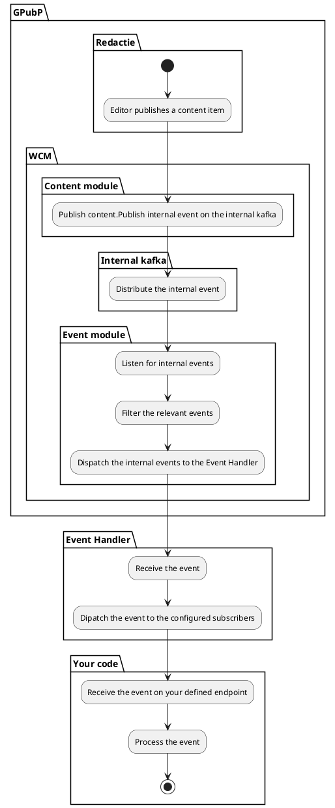

# Events consumeren

Events van de WCM worden ontsloten via de ACPaaS Event Handler Engine. Hieronder vind je een schematisch overzicht van hoe een eventstroom loopt.

[Hier kan je meer terugvinden](https://acpaas.digipolis.be/nl/product/event-handler-engine/v2.0.0/architecture) over de Event Handler Engine en de technische contouren.

## De eventstroom inrichten

Wil je een **event ontvangen** in jouw toepassing komt het kort gezegd hier op neer:

**Maak een ontvanger:**

1. Voorzie een HTTP endpoint dat de Event Handler oproept van zodra er een event zich voordoet

**Configureer de Event Handler:**

1. Maak een namespace aan
2. Maak één of meerdere topics aan binnen deze namespace
3. Abonneer je op een topic met de endpoint die je eerder hebt opgezet.

**Configureer de Redactie:**

1. Maak een bestemming aan
2. Maak één of meerdere afleveringen aan waarbij je interne gebeurtenissen aflevert op de Event Handler

### Maak een ontvanger

Zorg dat je een http endpoint hebt dat door de Event Handler aangesproken kan worden. De event handler zal  via een HTTP post de payload van het event afleveren op dit endpoint.
Je hoort deze endpoint te beveiligen via Basic Authentication, OAuth of een API Key.

> [!Tip]
> Wat als je nog aan't testen bent en je nog geen ontvanger voorhanden hebt?
> Wel, een tijdje geleden gebruikte we allerlei webooksites maar deze kunnen niet meer gebruikt worden in de Event Handler configuratie voor security redenen.
> Er is wel een alternatieve aanpak:
>
> 1. Ga naar deze service op de Digipolis API marketplace: <https://marketplace.digipolis.be/publications/4f9acc9a-d819-46aa-8296-bf11698cbe8d/version/4ee68235-1749-4eca-8ed5-291d550964d6/endpoint>
> 2. Maak een contract (al dan niet met een app of met je persoonlijke API sleutel)
> 3. Configureer een nieuwe Event Handler subscription op je gewenste namespace/topic. Gebruik hiervoor deze url <https://api-gw-a.antwerpen.be/peke/echo/v9>.
> Vergeet je `apikey` header niet in te stellen. Met je sleutel van het contract (stape 2).
> 4. Laat de events stromen en volg ze op door [deze logs te bekijken in de container logging](https://container-logging.antwerpen.be/app/dashboards#/view/dashboard-kubernetes-openshift-logs?_g=(filters:!(),refreshInterval:(pause:!t,value:0),time:(from:now-15m,to:now))&_a=(description:'',filters:!(('state':(store:appState),meta:(alias:!n,disabled:!f,index:pattern-k8s-logs,key:k8s_labels.antwerpen.be%2Fapp.keyword,negate:!f,params:(query:echochamber),type:phrase),query:(match_phrase:(k8s_labels.antwerpen.be%2Fapp.keyword:echochamber)))),fullScreenMode:!f,options:(hidePanelTitles:!f,useMargins:!t),query:(language:kuery,query:''),timeRestore:!f,title:'Kubernetes%20-%20Openshift%20Logs',viewMode:view)). Die toont alles wat er in de echo kamer aankomt. 

### Event Handler configuratie

Via onderstaande user interface kan je een namespace maken, topics definiëren en subscribers registreren:

* <https://eventhandler-ui-a.antwerpen.be>
* <https://eventhandler-ui.antwerpen.be>

Heb je geen toegang, vraag dan aan iemand van Digipolis om de namespace, topic en subscribers voor jou in te richten.

### Redactie configuratie

Ga naar de [redactie en configureer](/redactie/content/inrichten-events) welke gebeurtenissen je wil afleveren op de Event Handler.
