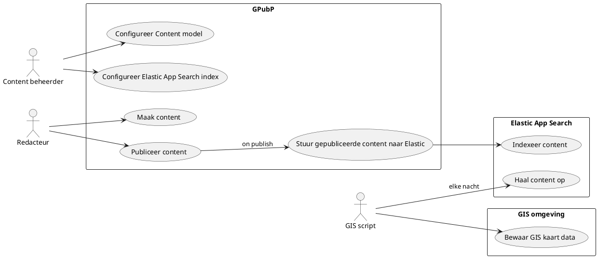

# Wegschrijven naar de GIS Server

Werken redactuers met een [GIS kaart](/redactie/content/inrichten-cc-gis-kaart), dan kan je de elementen die ze erop tekenen laten doorvloeien naar je GIS server.

## High level

Laten we eerst even het geheel bekijken in onderstaand schema:



Je zal je misschien afvragen waarom de content naar Elastic App Search wordt gestuurd? Dit is ons voorstel omdat je vanuit daar makkelijker kan opzoeken wanneer welke content is bijgekomen.
[Lees hier](/redactie/content/inrichten-search-beheren) hoe je de redactie kan inrichten om de content naar Elastic App Search te sturen.

Eénnaal de data in Elastic App Search zit kan je gebruik maken onderstaande query via de Elastic App Search API. Hierin geef je aan welke documenten je wil die veranderd zijn sinds die dag.
Je zal ook merken dat we enkel de data willen opvragen van `gis_kaart`, het content component waarin de redacteur de elementen tekende op de GIS kaart.

```shell
POST 'https://appsearch-ent1.antwerpen.be/api/as/v1/engines/{engine}/search' \
--header 'Content-Type: application/json' \
--header 'Authorization: Bearer {bearertoken}' \
--data '{
    "query": "",
    "result_fields": {
        "gis_kaart": {
            "raw": {}
        }
    },    
    "filters": {
        "last_modified": {
            "from": "2024-01-09T00:00:00+00:00",
            "to": "2024-01-09T23:59:59+00:00"
        }
    }
}'
```

Het resultaat van deze query ziet er als volgt uit:

```json
{
    "results": [
        {
            "gis_kaart": {
                "raw": [
                    "{\"mapControls\":{\"latLng\":{\"lat\":51.18219460641229,\"lng\":4.418134689331056},\"zoom\":14},\"mapData\":{\"type\":\"FeatureCollection\",\"features\":[{\"type\":\"Feature\",\"properties\":{\"type\":\"polyline\",\"color\":{\"label\":\"Afval en recyclage (petrol)\",\"value\":\"#007FA3\"},\"length\":661.48,\"name\":\"Polylijn 1\"},\"geometry\":{\"type\":\"LineString\",\"coordinates\":[[4.412908,51.181818],[4.422351,51.18241]]},\"id\":2703,\"style\":{\"color\":\"#007FA3\"}},{\"type\":\"Feature\",\"properties\":{\"type\":\"polygon\",\"color\":{\"label\":\"Afval en recyclage (petrol)\",\"value\":\"#007FA3\"},\"area\":325506.6,\"perimeter\":2323.32,\"name\":\"Veelhoek 1\"},\"geometry\":{\"type\":\"Polygon\",\"coordinates\":[[[4.433769,51.186176],[4.438577,51.183647],[4.431881,51.181603],[4.425871,51.183486],[4.427417,51.187306],[4.433769,51.186176]]]},\"id\":2738,\"style\":{\"color\":\"#007FA3\"}},{\"type\":\"Feature\",\"properties\":{\"type\":\"polygon\",\"color\":{\"label\":\"Sporten en bewegen (groen)\",\"value\":\"#007B5F\"},\"area\":201858.07,\"perimeter\":2262.26,\"name\":\"Veelhoek 3\"},\"geometry\":{\"type\":\"Polygon\",\"coordinates\":[[[4.4263,51.174715],[4.4263,51.176706],[4.43935,51.176706],[4.43935,51.174715],[4.4263,51.174715]]]},\"id\":2795,\"style\":{\"color\":\"#007B5F\"}},{\"type\":\"Feature\",\"properties\":{\"type\":\"circle\",\"color\":{\"label\":\"Kinderen en jeugd (paars)\",\"value\":\"#8031A7\"},\"radius\":209.41878660188092,\"area\":137778.4,\"perimeter\":1315.82,\"name\":\"Cirkel 1\"},\"geometry\":{\"type\":\"Point\",\"coordinates\":[4.446819,51.183002]},\"id\":2825,\"style\":{\"color\":\"#8031A7\"}},{\"type\":\"Feature\",\"properties\":{\"type\":\"marker\",\"color\":{\"label\":\"Gezondheid (blauw)\",\"value\":\"#0057B7\"},\"name\":\"Markering 1\"},\"geometry\":{\"type\":\"Point\",\"coordinates\":[4.416084,51.178859]},\"id\":2981,\"style\":{\"color\":\"#0057B7\"}}]}}"
                ]
            },
            "_meta": {
                "engine": "wcm-gis-data-el-pizza-slicer-evaluatie-production-nl",
                "score": 1.0,
                "id": "aa1d8505-562a-4ed6-8ea3-65519148f709"
            },
            "id": {
                "raw": "aa1d8505-562a-4ed6-8ea3-65519148f709"
            }
        },
        {
            "gis_kaart": {
                "raw": [
                    "{\"mapControls\":{\"latLng\":{\"lat\":51.216131559763845,\"lng\":4.44947849390387},\"zoom\":13},\"mapData\":{\"type\":\"FeatureCollection\",\"features\":[{\"type\":\"Feature\",\"properties\":{\"type\":\"marker\",\"color\":{\"label\":\"Afval en recyclage (petrol)\",\"value\":\"#007FA3\"},\"name\":\"Markering 1\"},\"geometry\":{\"type\":\"Point\",\"coordinates\":[4.468386,51.216669]},\"id\":2314,\"style\":{\"color\":\"#007FA3\"}}]}}"
                ]
            },
            "_meta": {
                "engine": "wcm-gis-data-el-pizza-slicer-evaluatie-production-nl",
                "score": 1.0,
                "id": "559cd4d9-40cf-44f7-85df-54d9834f26f1"
            },
            "id": {
                "raw": "559cd4d9-40cf-44f7-85df-54d9834f26f1"
            }
        }
    ],
    "meta": {
        ...
    }    
}
```

Vervolgens kan je uit `gis_kaart.raw` de json unescapen. Het resultaat is zoals onderstaande:

```json
{
  "mapControls": {
    "latLng": {
      "lat": 51.216131559763845,
      "lng": 4.44947849390387
    },
    "zoom": 13
  },
  "mapData": {
    "type": "FeatureCollection",
    "features": [ 
      {
        "type": "Feature",
        "properties": {
            "id": 213,
            "type": "polygon",
            "name": "Veelhoek 1",
            "color": {
                "label": "Afval en recyclage (petrol)",
                "value": "#007FA3"
            },
            "dimensions": {
                  "area": 5632544.62,
                  "perimeter": 10088.43,
            },
            "fields": {
                "code": {
                    "textType": "div",
                    "text": "ABCDE"
                },
                "contact-e-mail": "erik.lenaerts@digipolis.be",
                "contact-naam": {
                    "textType": "div",
                    "text": "Erik Lenaerts"
                }
            }
        },
        "geometry": { ... }
      }
    ]
  }
}
```

Het elemenent `mapData` bevat de officiele **GeoJSOn** data.

?> [Lees hier meer over](/redactie/content/inrichten-cc-gis-kaart?id=output-met-een-getekend-element-op-de-gis-kaart) hoe de GIS kaart data opgebouwd is.
