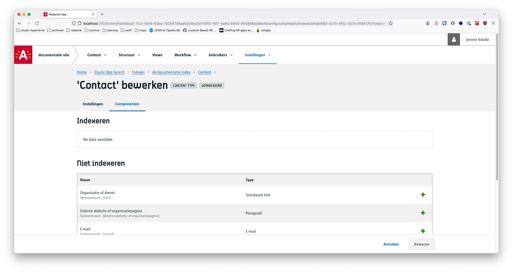
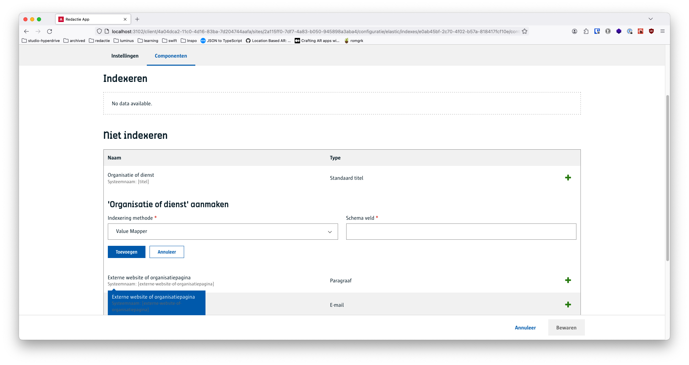
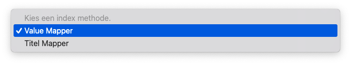
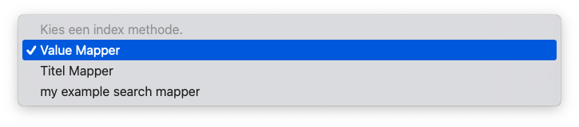

# Search helper package
De search helper package biedt de mogelijkheid om bij het registeren van een nieuw module 
een versimpelde manier om nieuwe mappers toe te voegen. 
Zowel content als search mappers kunnen toegevoegd worden.


## Voorbereiding
Om deze gids te kunnen volgen heb je de volgende zaken nodig
- Je hebt De Redactie reeds [lokaal draaien](/modules/content/setup/redactie/setup).
- Je hebt het WCM reeds [lokaal draaien](/modules/content/setup/wcm/index.md)

## Installatie
Om de search helper package te installeren voer je volgend commando uit:
```bash
npm install @wcm/images-bsl-helper
```
## De instantie aanmaken
In mijn voorbeeld maak ik gebruik van nestjs. Bij de opstart van de module en wanneer de tenantConfig klaar is met registreren van de modules, registreer ik de search helper package met de nieuw helpers. 
```typescript
export class IndexModule {
	configure() {
		if (!tenantConfig.getModuleContext()) {
			tenantConfig.on('ready', () => {
				//de registratie van de mappers gaat hier gebeuren
			});
		}
	} 
}
```
### Importeer de module
```typescript
import { SearchHelper } from '@wcm/images-bsl-helper'
```
### Registreer de mappers
Maak hier de instantie van de search helper aan. De searchHelper verwacht hier dat je de tenantConfig meegeeft als parameter.
```typescript
const searchHelper = new SearchHelper(tenantConfig);
```
Eens je de instantie hebt kan je enkel functies aansrpeken. 

### registerContentMappers
De registerContentMappers functie verwacht een array van mappers. Deze worden in de content engine geregistreerd.
```typescript
searchHelper.registerContentMappers([
	{
		name: 'example-mapper-2', function: 'MODULE-REQUEST', parameters: {
			path: '/v1/content-mappers/example-mapper-2', query: {}, extraInfo: {}
		}
	},
	{
		name: 'example-mapper-1', function: 'MODULE-REQUEST', parameters: {
			path: '/v1/content-mappers/the-example-mapper-1', query: {}, extraInfo: {}
		}
	}
]);
```

### registerSearchMappers
De registerSearchMappers functie verwacht een array van mappers. Deze worden in de search engine geregistreerd. In het ref object kan je de id van de fieldType/dataType/preset meegeven.
Door deze referentie mee te geven worden deze mappers aan een bepaalde fieldType/dataType/preset gekoppeld en zal je deze ook in de user interface kunnen gebruiken.
```typescript
searchHelper.registerSearchMappers([
    {
        targetFieldType: 'FIXED',contentMapper:'example-mapper-2',  defaultTargetFieldName: 'example mapper', label: 'my example mapper', targetOperators: [
            {
                source: {
                    path: '',
                    isAbsolute: true
                },
                destination: {
                    path: '',
                    isAbsolute: false
                }
            }
        ],
        refs: [
            {
                type: 'fieldType',
                isDefault: false,
                ref: '86a902a5-1b6b-464e-a121-3d392e53586c'
            }
        ]
    }
]);
```

Aan de hand van enkele screenshots wordt het toevoegen van een searchMapper verduidelijkt.
### 1. Ga naar de search
Navigeer naar een index binnen een site. Hier kan je een contentType openen en zul je zien dat je de componenten kan bekijken.
[](./images/gpubp-search-1.png)
### 2. Component openen
Bij het openen van een component zal je zien dat je een searchMapper kan toepassen per fieldType.
[](./images/gpubp-search-2.png)
### 3. SearchMapper toevoegen
Eens we op de dropdown klikken kunnen we een searchMapper selecteren. We zien dat onze searchMapper hier nog niet tussen staat.
Je gaat deze zoals in de bovenstaande code snippet moeten registreren.
[](./images/gpubp-search-3.png)
### 4. SearchMapper toevoegen
Eens we de searchMapper hebben toegevoegd kunnen we deze selecteren en toepassen.
[](./images/gpubp-search-4.png)
