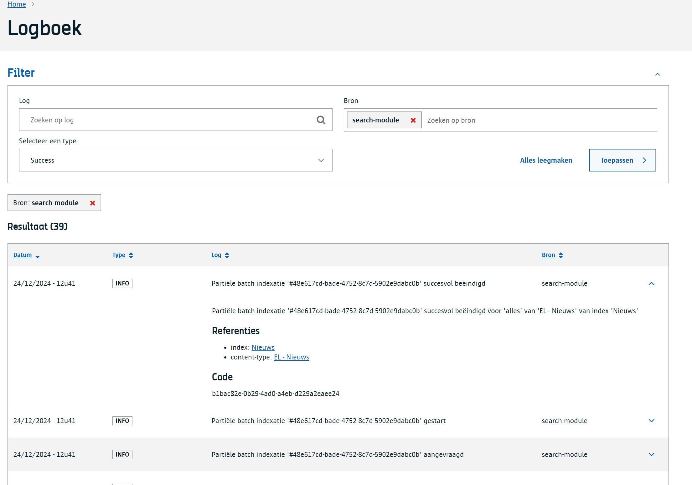

# Logbook module

> [!info|label:Definitie]
> Met deze module kan je logs sturen naar een gecentraliseerde log in de WCM. De logs zijn rechtrstreeks beschikbaar en doorzoekbaar in de WCM.

## Logs raadplegen
De essentie van deze module is om logs te centraliseren per site en tenant zodat [Content beheerders](/redactie/content/toegang-content-beheerder) of [Site beheerders](/redactie/content/toegang-site-beheerder) een eerste idee kunnen vormen van de gebeurtenissen in het systeem. Hiermee kunnen ze een indicatie krijgen ingeval van problemen. Voor uitgebreide logging is het wel noodzakelijk om de technische logs erbij te nemen. 

Ga hiervoor naar de tenant of site naar keuze en selecteer `logboek`.


## zoeken in het logbook
!> todo

## Hoe gebruik ik als ontwikkelaar het logbook 

Door gebruik te maken van de `requestModule` functie van `tenantConfig` kan de logbook module aangesproken worden door andere WCM modules. De logbook module verwacht een body met volgende parameters: 

```json
{
  "title": "logging entry title",
  "code": "logbook.code",
  "identifier": "string",
  "type": "error",
  "references": [{
    "value": "some val",
    "type": "link",
    "url": "https://google.com",
    "label": "google label",
    "description": "the description"
  }],
  "extraInfo": "extra info",
  "stack": "some stacktrace",
  "content": "logbook content",
  "date": "yyyy-MM-ddTHH:mm:ssZ",
  "source": "logbook source",
  "threshold": {
    "count": 2,
    "period": 3000,
    "noLogDuration": 60000
  }
}
```

De `date` parameter verwacht een UTC formaat. De threshold parameter is optioneel en verwacht voor de `period` en de `noLogDuration` een waarde in milliseconden.'
Bij het doorsturen van een log entry kan de `type` parameter de volgende waarden bevatten: `info`, `warning`, `error`, `success`.

Voor het schrijven naar de logbook module voor een site kan de volgende implementatie gebruikt worden:

```javascript
await tenantConfig.requestModule(
    tenantKey,
    'logbook',
    'POST',
    `v1/sites/${site}/logbook-items`,
    {
        json: loggingContent,
    }
)
```

Voor het schrijven naar de logbook module voor een tenant kan de volgende implementatie gebruikt worden:

```javascript
await tenantConfig.requestModule(
    tenantKey,
    'logbook',
    'POST',
    `v1/logbook-items`,
    {
        json: loggingContent,
    }
)
```

Waarbij `tenantKey` opgehaald kan worden via: 
```
static getTenantKey(tenantApikey: string): string {
    const allApps = tenantConfig.getAllApps();
    return allApps.find((app: any) => app.uuid === tenantApikey)?.apikey;
}
```

## Threshold
Zoals eerder vermeld is de threshold parameter optioneel. 
Deze parameter zorgt ervoor dat je logs kan beperken als deze teveel binnen een periode aangeroepen worden. De `count` parameter bepaalt hoeveel logs er maximaal mogen aangemaakt worden binnen de `period` parameter. De `noLogDuration` parameter bepaalt hoe lang er geen logs mogen aangemaakt worden na het overschrijden van de `count` parameter.

```json
{
  "threshold": {
    "count": 2,
    "period": 3000,
    "noLogDuration": 60000
  }
}
```

## References
De `references` parameter is optioneel en kan gebruikt worden om extra informatie toe te voegen aan de log entry. Deze kan meerdere links bevatten naar waar de log entry over gaat.

```json
{
  "references": [{
    "value": "some val",
    "type": "link",
    "url": "https://google.com",
    "label": "google label",
    "description": "the description"
  }]
}
```

## Visualisatie
[](../../assets/logbook-module.png)

?> Ga terug naar het [overzicht van alle modules](/modules/content/wcm-modules)
