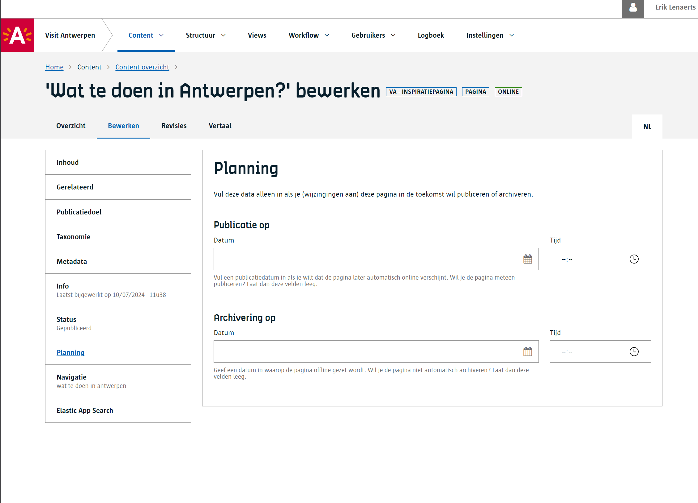

# Content plannen

Content plannen betekent dat je content op een bepaald tijdstip kan publiceren en/of archiveren.

Bewerk het content item en ga naar het `Planning` compartiment en vul een tijdstip in. Je kan ofwel gepland publiceren of archiveren of je kan beide plannen.  

## Enkele aandachtspunten

- Je kan geen content item plannen voor publicatie als dit reeds gepubliceerd is. Hetzelfde geldt voor het archiveren.
- Wanneer er iets gepland is (publiceren of archiveren) zal er bovenaan het content item in de Redactie een waarschuwing verschijnen.
- Je kan een geplande actie ongedaan maken door het tijstip terug te verwijderen in het Planning compartiment.

!> Belangrijk om te weten is dat **de Redactie om het kwartier de planning uitvoert**. Plan je een publicatie in om 16:01 dan zal het systeem deze effectief publiceren om 16:15. Het is daarom aangeraden om steeds een planning in te stellen op uur zelf, kwart na het uur, het half uur of kwart voor het uur.  