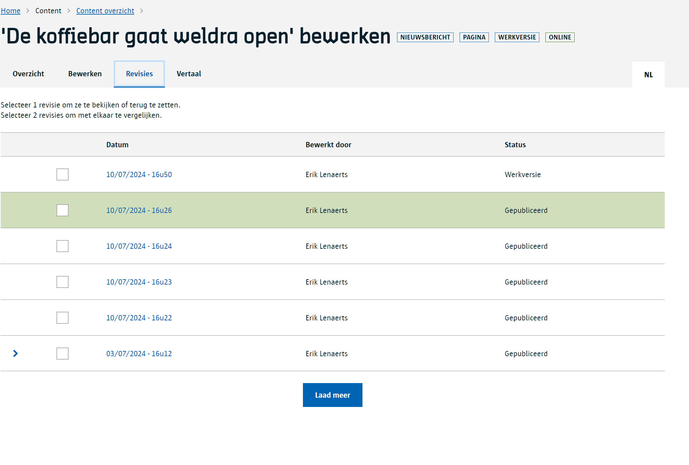
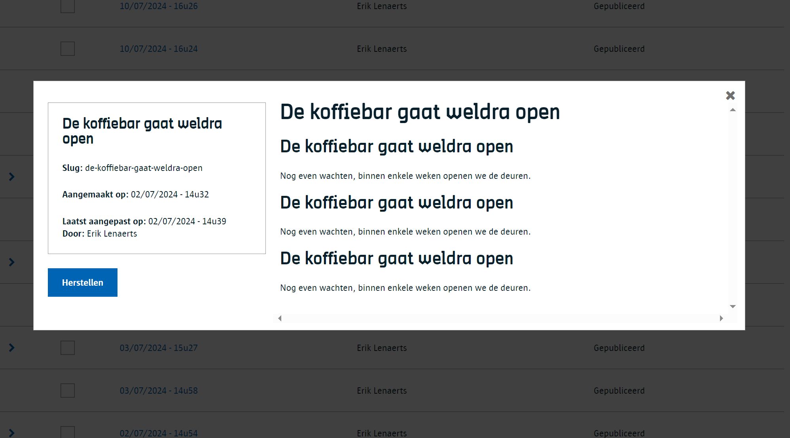
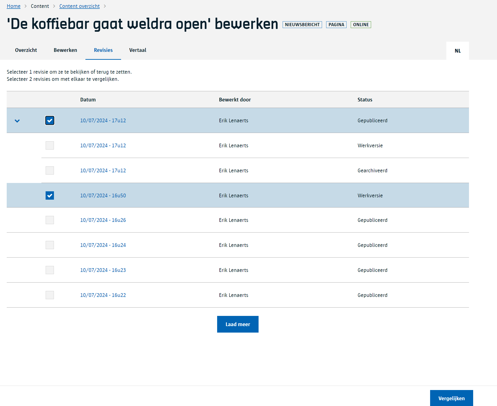
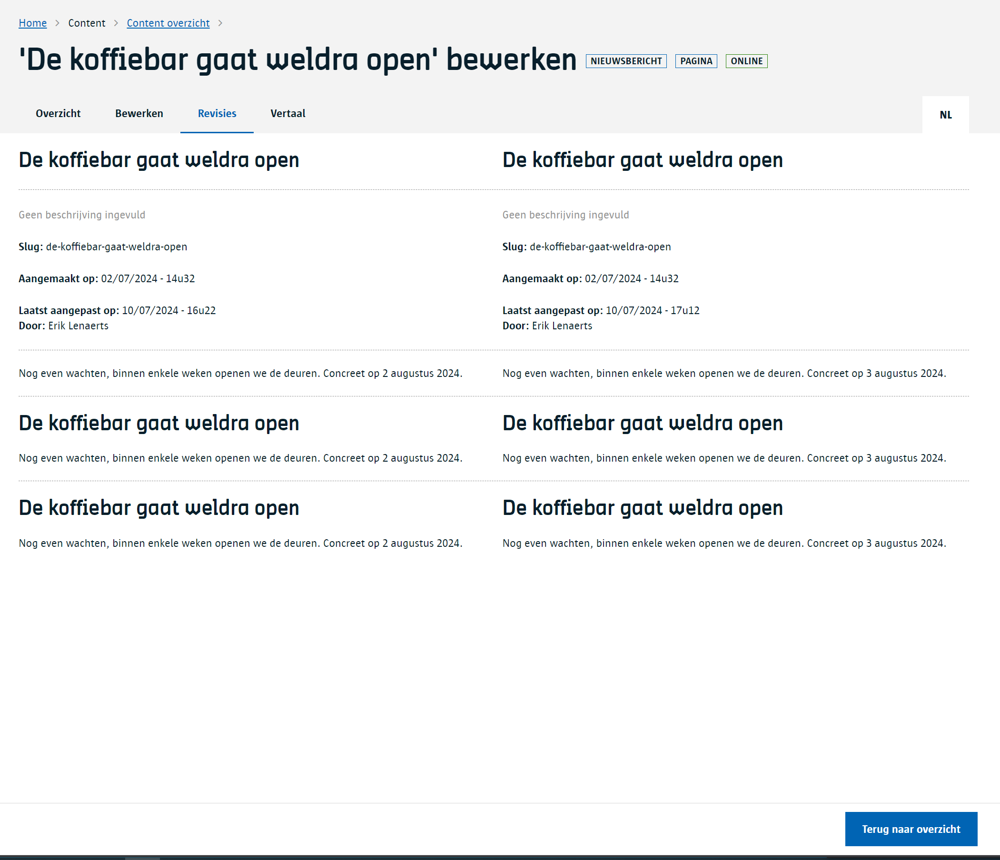
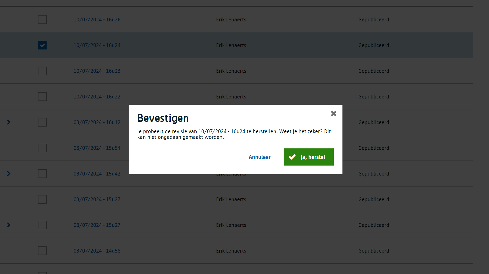

# Revisies

Elke keer dat je [content bewaart](/redactie/content/content-beheren-schrijven?id=content-bewaren) wordt er een nieuwe revisie gemaakt. De redactie bewaart alle revisies doorheen de tijd.

Dit systeem heeft enkele voordelen:

- Je kan content aanpassen terwijl een vorige revisie online staat (zie [content life cycle](/common/content/content-life-cycle)).
- Je kan zien wie aanpassingen gedaan heeft doorheen de tijd.
- Je kan een eerdere revisie bekijken.
- Je kan verschillende revisies met elkaar vergelijken.
- Je kan terugkeren naar een eerdere revisie.

Laten we deze even in meer detail bekijken

## Werken met werkversies

Vaak zal je als redacteur aanpassingen moeten maken aan bestaande content die op dat moment al online staat.
Het systeem laat toe om bestaande content aan te passen en deze wijzigingen te bewaren zonder dat je dit meteen moet publiceren. Laten we een voorbeeld nemen:

1. je hebt een nieuw [content item gemaakt](/redactie/content/content-beheren-schrijven?id=nieuwe-content-maken) als een werkversie *(revisie 1)*
2. even later pas je iets aan en [bewaar](/redactie/content/content-beheren-schrijven?id=content-bewaren) je opnieuw het content item als werkversie *(revisie 2)*
3. je besluit om dit te [publiceren](/redactie/content/content-beheren-schrijven?id=content-publiceren) waardoor je opnieuw een nieuwe revisie krijgt, deze keer gepubliceerd *(revisie 3)*.
4. je bekijkt je content online je website en stelt vast dat je iets moet aanpassen
5. je past de content aan, zet de status op werkversie en bewaart *(revisie 4)*.
6. Merk op dat bezoekers van je site op dit moment nog steeds de inhoud zien van revisie 3.
7. Je bekijkt via de [preview functie](/redactie/content/content-beheren-preview) hoe je wijziging van revisie 4 er gaan uitzien.
 Enkel jij kan zien wat het gaat worden. Bezoekers zelf zien nog steeds revisie 3.
8. je publiceert je laatste wijzgingen zodat iedereen deze de laatste revisie ziet *(revisie 5)*.

## De revisie geschiedenis bekijken

Open een content item vanuit het content overzicht en klik op de `Revisies` knop (onder de titel).

Hier zie je het overzicht van de verschillende revisies. De groene lijn geeft aan dat die revisie momenteel online staat voor de bezoekers van je site.
Zoals je kan zien in het voorbeeld hierboven is er na de publicatie van 16:26 een aanpassing gebeurt en als werkversie bewaart.

Als het content item gearchiveerd wordt zal die revisie rood gekleurd worden.

Klik je op de datum van een revisie dan kan je in een apart venster zien wat de inhoud er toen van was.

## Revisies met elkaar vergelijken

In het overzicht van de revisies selecteer je twee revisies door ze te selecteren vooraan met een vinkje en vervolgens onderaan op de knop vergelijken te klikken.

## Terugdraaien naar een eerdere revisie

In het overzicht van de revisies selecteer je één revisie en klik je onderaan op `herstellen`. Na een bevestiging zal er een nieuwe revisie gemaakt worden met de inhoud van de revisie die je koos bij de herstelling.

