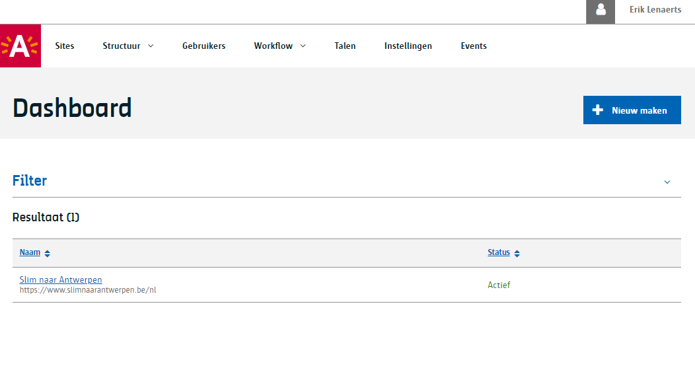
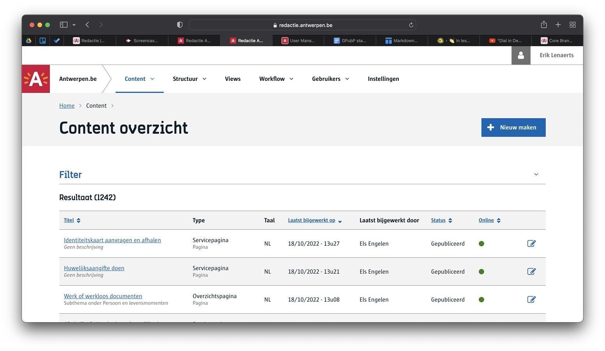
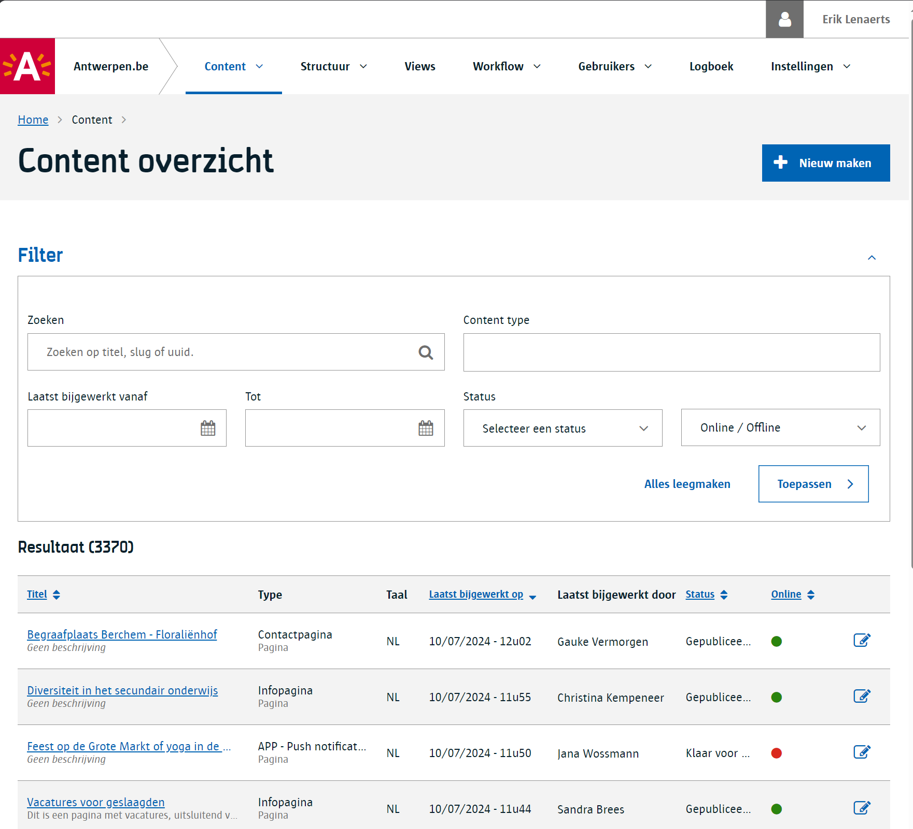
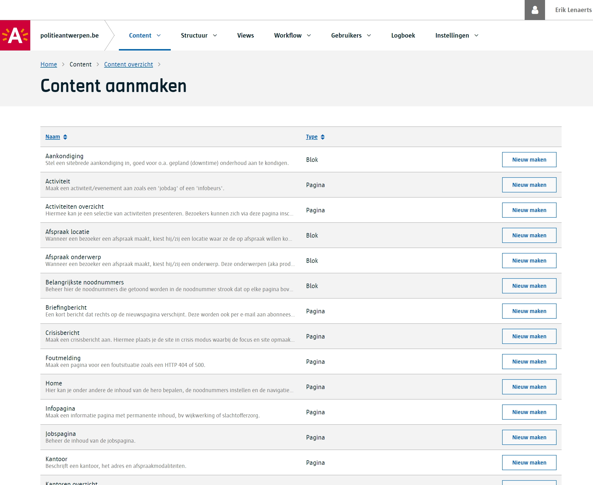
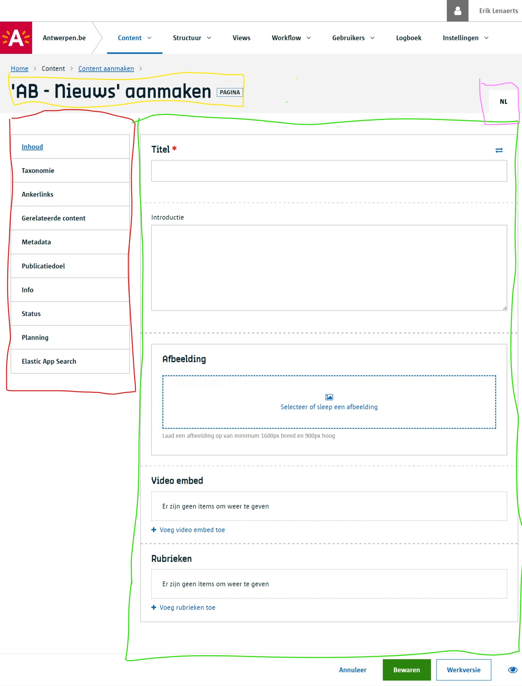
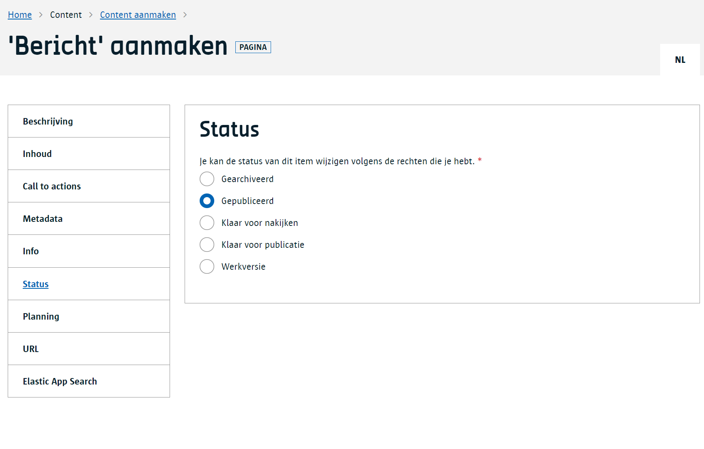
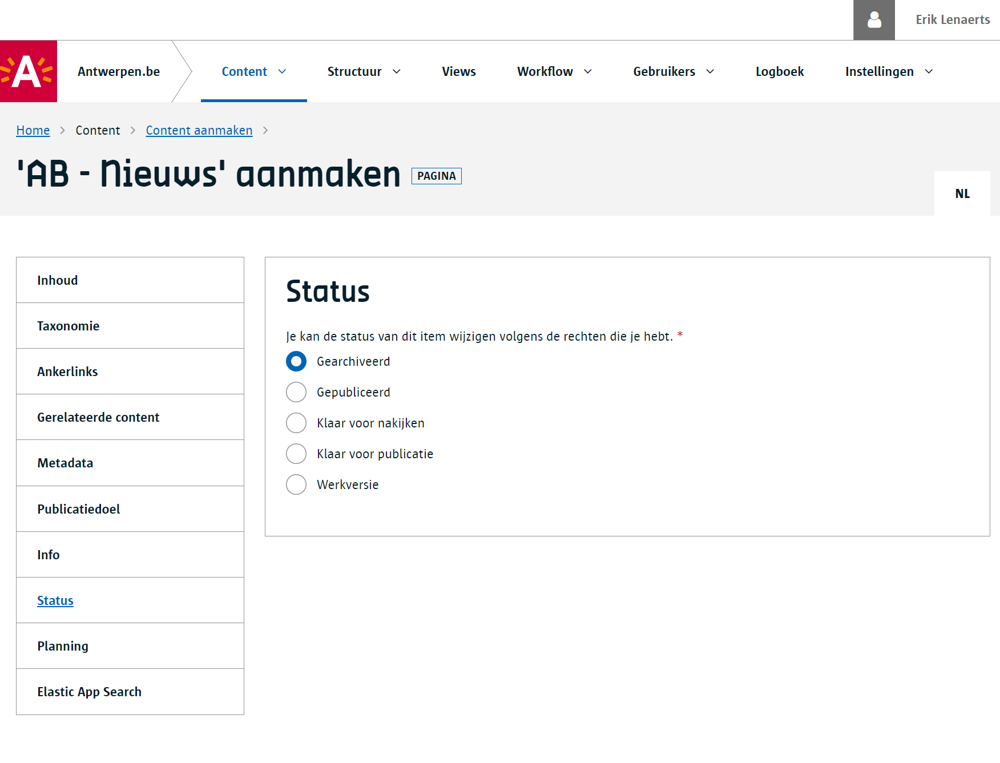
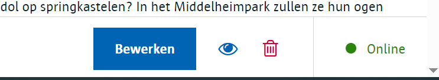
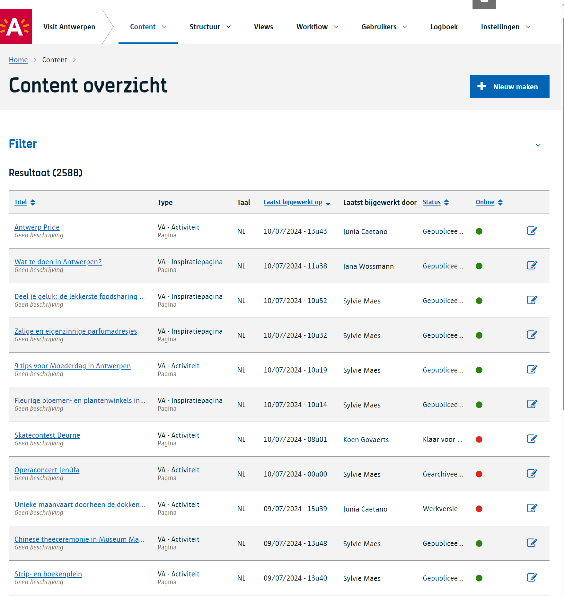

# Content schrijven

Het belangrijkste doel van de Redactie is het maken, aanpassen en publiceren van `content`.

> [!info|label:Definitie]
> `Content` is een algemen term die we gebruiken voor de teksten die je schrijft, de beelden of bestanden die je toevoegt, linken die je legt, etc.

In [de introductie](/common/content/content-beheer) kan je meer leren over het Redactie systeem en de vaak voorkomende termen.

## Index

- [Index](#index)
- [Voorbereidingen](#voorbereidingen)
- [Content overzicht](#content-overzicht)
- [Nieuwe content maken](#nieuwe-content-maken)
- [Content bewaren](#content-bewaren)
- [Content publiceren](#content-publiceren)
- [Content archiveren](#content-archiveren)
- [Content verwijderen](#content-verwijderen)
- [Content lifecycle](#content-lifecycle)

## Voorbereidingen

1. Voor je als redacteur aan de slag kunt moet je eerst [toegang krijgen als gebruiker](/redactie/content/toegang-aanvragen) tot de Redactie.
2. Eenmaal je toegang hebt, kan je aan een [beheerder](/redactie/content/toegang-site-beheerder) vragen om toegang te krijgen tot een site. Hij of zij zal je dan een [een rol toekennen](/redactie/content/toegang-rollen-rechten).

## Content overzicht

1) Open de redactie via volgende url: <https://redactie.antwerpen.be>. Hier krijg je een overzicht van [tenants](/common/content/concept-tenant) te zien waar je toegang tot hebt.

2) Nadat je op de titel van een tenant hebt geklikt, krijg je een overzicht van alle [sites](/common/content/concept-site). Soms zal je hier één site zien, soms meerdere.
Heeft de naam van je site een link dan betekent dat je hiervoor toegang hebt. Zoniet, moet je dit vragen aan je beheerder.

    

3) Open de site en je ziet vervolgens het content overzicht. Van hieruit kan je zoeken naar bestaande content of nieuwe maken.

    

4) Wil je op zoek gaan naar content klik dan op het woord `Filter` waarmee een paneel openschuift met zoek - en filtermogelijkheden.
    In dit overzicht kan je ook content sorteren door (meermaals) op de kolomhoofdingen te klikken.
    De link vooraan brengt je naar de detail pagina van het [content item](/common/content/concept-ci), de knop achteraan in de tabel brengt je meteen in de bewerk modus van dit content item.
    Daarnaast zie je op het content overzicht ook de status en de online/offline indicator waar je hieronder meer over kan lezen.

    

?> In [deze video](https://app.screencastify.com/v3/watch/cT6PcWKM6wmLkvyLUP4x) *(23 min)* leggen we de basics uit voor het werken met content.

## Nieuwe content maken

Als je nieuwe content wil maken krijg kan je kiezen uit een lijst van [Content Types](/common/content/concept-ct), zeg maar de template die je gaat gebruiken voor het maken van een nieuw [content item](/common/content/concept-ci).

Merk op dat er 2 soorten zijn, namelijk `Pagina's` en `Blokken`. Met de eerste maak je een volledige onafhankelijke pagina op waar je als burger naar kan surfen.
Het tweede (de blokken) zijn dikwijls kleinere stukjes content die hergebruikt worden op één of meerdere pagina's.

Eenmaal je een keuze hebt gemaakt uit de lijst van content types kan je aan de slag gaan om de content in te voeren.

We lichten even de zones toe:

* **hoofding (geel):** Bovenaan zie je wat je gaat maken o.b.v. het eerder gekozen content type. Je krijgt hier ook de aanduiding of het gaat om een blok of pagina.
* **taal (roos):** In meertalige sites ga je rechstbovenaan zien voor welke taal je content aan het invoeren bent. (Zie ook [vertalen van content](/redactie/content/content-beheren-vertalen)).
* **compartimenten (rood):** Links op het scherm staan compartimenten. In plaats van één grote lijst van invoer vakken te voorzien, kan een content beheerder de lijst opdelen.
Hierdoor wordt het invoeren van content aangenamer en kan je sneller navigeren naar het specifieke deel waaraan je wil werken.
* **invoer (groen):** Dit is de plek waar je de content effectief kan invoeren. Je zal merken dat er heel veel verschillende manieren zijn om content in te voeren welke afhankelijk zijn van het soort.
Bij een [Video embed](/redactie/content/inrichten-cc-video-embed) is het voldoende om een YouTube url te plakken, 
bij een [tekstvak met opmaak](/redactie/content/inrichten-cc-tekstvak-met-opmaak) ga je met een (beperkte) tekst editor kunnen werken.

## Content bewaren

Nadat je de content hebt ingevoerd kan je deze bewaren, hiervoor gebruik je onderaan de pagina de `Bewaren` knop.
Je zal merken dat er ook een `Annuleer` knop is; deze zal alle onbewaarde aanpassingen terug weghalen.

Het systeem zal de redacteur informeren als er content is ingevoerd dat niet voldoet aan de verwachtingen.
Soms zal er een verplicht veld zijn dat nog leeg is waardoor je het content item niet kan bewaren totdat dit is opglost.

Telkens als je content bewaart zal je een nieuwe `revisie` maken waarbij de vorige revisie ook nog onthouden wordt door het systeem.
[Lees hier](/redactie/content/content-beheren-revisies) hoe je vorige revisies kan bekijken en er naar terug gaan.

Wil je het tussentijds resultaat al eens bekijken, dan kan je gebruik maken van de `preview` functie. Lees er [hier meer over](/redactie/content/content-beheren-preview).

## Content publiceren

`Publiceren` is een term die je vaak zal horen. Het geeft aan dat je klaar bent om de content life te zetten zodat deze verschijnt in de website.

Je kan content publiceren door naar het status compartiment te gaan en daar de status te verzetten op `gepubliceerd` en vervolgens te bewaren.

!> Van zodra je de content gepubliceerd hebt is het een natuurlijke reflex om te gaan kijken naar de website om je werk daar te kunnen nakijken. Afhankelijk hoe de website gebouwd is zal je je aanpassingen niet meteen zien maar pas na enkele minuten. Deze vertraging kan weggewerkt worden door de makers van de website als ze gebruik maken van het [Event systeem](/redactie/content/inrichten-events?id=hou-je-content-cache-up-to-date). Alternatief kan je ook hier gebruik maken van de [preview functie](/redactie/content/content-beheren-preview).

?> Wist je dat je ook [publicaties kan plannen](/redactie/content/content-beheren-plannen)?

## Content archiveren

`Archiveren` betekent dat je als redacteur content terug offline haalt zodat deze niet meer zichtbaar is voor bezoekers van je website.
Ga naar het status compartiment en kies voor `gearchiveerd` en bewaar het content item.

## Content verwijderen

Naast archiveren kan je content items ook permanent verwijderen. Als je het recht hebt om dit te doen zal er een rode vuilbak knop onderaan de knoppenbalk verschijnen.

!>Let op: je kan een verwijderd content item niet terughalen, er is geen herstel functie voor.

## Content lifecycle

Telkens als je een content item bewaart, krijg je een nieuwe revisie. Telkens als je content publiceert ga je de content van dat moment life zetten. Telkens als je archiveert haal je de content offline.
Het is heel normaal dat je als redacteur vele aanpassingen maakt aan een content item met verschillende publicaties tussendoor.
Om goed te begrijpen wat er nu life staat kan je best de [Content life cycle lezen uit de introductie](/common/content/content-life-cycle).

In het content overzicht kan je zien of een content item online staat (groen bolletje) of offline (rood bolletje).Daarnaast zie je de de huidige status (werkversie, klaar voor nakijken, gepubliceerd, ...).
Zie je bevoorbeeld `werkversie` en een groen bolletje dan betekent dit dat dit content item online staat maar dat je ondertussen bezig bent aan een nieuwere (werk)versie die nog niet klaar en gepubliceerd is. 

