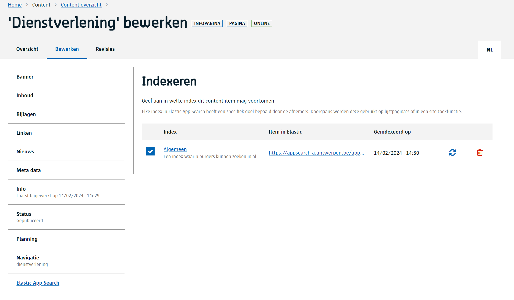

# Search

De meeste websites of apps die gemaakt zijn met het GPubP hebben een zoekfunctie.
Soms zijn er meerdere zoekfuncties zoals een algemene zoek en een specifieke zoek voor een apart e-loket.
Bezoekers van je website verwachten een efficiente zoekfunctie zoals ze dat gewoon zijn van bv Google of Bing.

Content in het GPubP is standaard niet geoptimaliseerd om door te zoeken daarom maken we gebruik van Elastic App Search (EAS).
Dit is een `search engine` waarmee je ondermeer:

- je kan aangeven wat in een zoekopdracht het zwaarste moet doorwegen, de url, de titel, de teaser, ...
- je kan synoniemen opmaken zodat zoeken op 'covid19' ook content terugvindt waar 'corona' in voorkomt
- je kan bepaalde pagnina's vastpinnen bovenaan de zoek resultatenlijst voor specifieke zoekopdrachten
- de zoekmotor houdt rekening met vervoegingen, enkelvoud/meervoud, etc.

## Inrichten

Nu, om gebruik te maken van EAS moet dit eerst geconfigureerd worden door de [content beheerder](/redactie/content/toegang-content-beheerder). Als redacteur hoef je hier niet veel voor te doen.

Content beheerders gaan één of meerdere `zoek indexen` opzetten, zeg maar aparte potjes waarin er een duplicaat van jou geschreven content inzit maar anders gevormd zodat er heel snel op gezocht kan worden.
Elke index kan andere content bevatten maar dat hoeft niet, éénzelfde content kan ook in meerdere indexen voorkomen.
Zo is het vaak dat er een index `algemeen` is waar alle content in voorkomt en daarnaast nog een kleinere index met enkel nieuws content.

> [!info|label]
> Weet dat een content item automatisch geïndexeerd wordt wanneer je het als redacteur publiceert. Het wordt ook automatisch uit de index gehaald van zodra je het archiveert of verwijdert.

## Indexeren opvolgen

Als [Redacteur](/redactie/content/toegang-redacteur) kan je ook nagaan wanneer een [content item](/common/content/concept-ci) opgenomen is in een [index](/redactie/content/inrichten-search-indexvsengine).
Hiervoor bestaat er een compartiment op het content item `Elastic App Search`.

### Wat kan ik als Redacteur doen?

Als je content item voorkomt in een index en je hebt de nodige rechten, dan kan je:

1. Zien wanneer het content item laatst geïndexeerd is
2. Het content item verwijderen uit een index
3. Het content item herindexeren
4. Aangeven dat dit content item niet mag opgenomen worden in de index. Dit doe je door vooraan het vinkje uit te zetten.

### Waarom zie ik het Elastic App Search compartiment niet?

Er kunnen meerdere redenen zijn waarom je het `Elastic App Search` compartiment niet ziet:

- De [Search module](/modules/content/modules/module-search) is niet geactiveerd voor je tenant.
- Er zijn geen [indexen](/redactie/content/inrichten-search-beheren) ingericht door de Content Beheerder.
- Er zijn wel indexen, maar niet voor dit [Content Type](/common/content/concept-ct).
- Je hebt niet de [juiste rechten](/redactie/content/inrichten-search-beheren?id=rechten) om indexering informatie te mogen zien.

