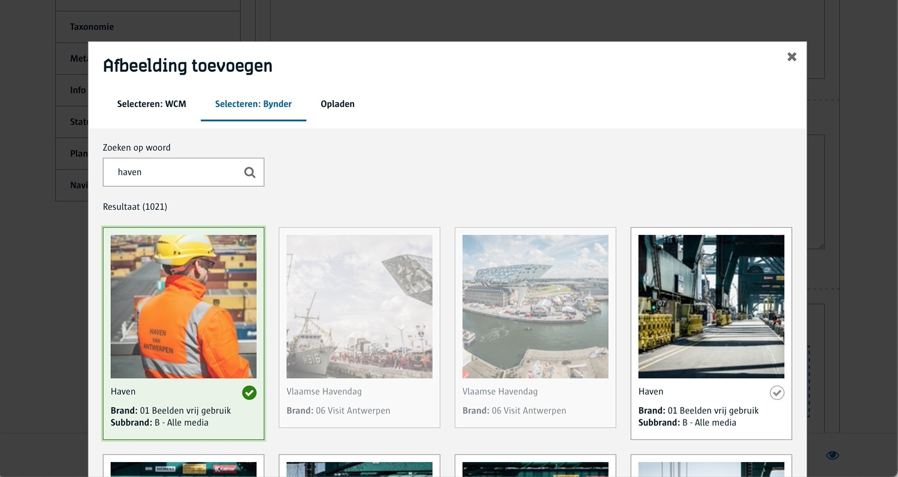
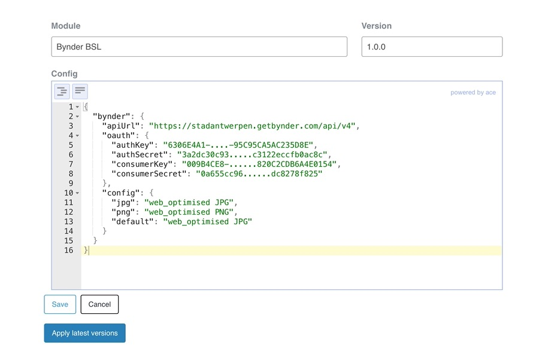

# Bynder inrichten

Met deze module kan je aan een redacteur een afbeelding laten kiezen uit de beeldenbank Bynder. 



> Zorg ervoor dat de [Bynder module](/modules/content/modules/module-bynder) geactiveerd is voor je tenant. 

## Bynder inrichten

De afbeeldingen komen uit de Bynder beeldenbank. 

* zorg dat je beelden hebt in Bynder en dat deze toegekend zijn aan één of meerdere Brands.
* zorg dat er een gebruikersprofiel is dat rechten heeft op de eerder gekozen Brands.
* zorg dat er via de API gewerkt kan worden voor dit gebruikersprofiel  

> [!info|label:Aanvraag]
> Meer info bij **Sven Beatens** voor de inrichting van Bynder.


## Voorbereiding redactie

Vooraleer een redacteur afbeeldingen kan kiezen uit Bynder zal een [Tenant beheerder](/redactie/content/toegang-tenant-beheerder) eerst moeten aangeven met welk gebruikersprofiel er gewerkt zal worden. Dit wordt in de WCM Admin ingesteld bij de Bynder BSL. 



Gebruik voor de configuratie volgende json:

```json
{
  "bynder": {
    "apiUrl": "https://stadantwerpen.getbynder.com/api/v4",
    "oauth": {
      "authKey": "6306E4A1-....-95C95CA5AC235D8E",
      "authSecret": "3a2dc30c93.....c3122eccfb0ac8c",
      "consumerKey": "009B4CE8-......820C2CDB6A4E0154",
      "consumerSecret": "0a655cc96......dc8278f825"
    },
    "config": {
      "jpg": "web_optimised JPG",
      "png": "web_optimised PNG",
      "default": "web_optimised JPG"
    }
  }
}
```
