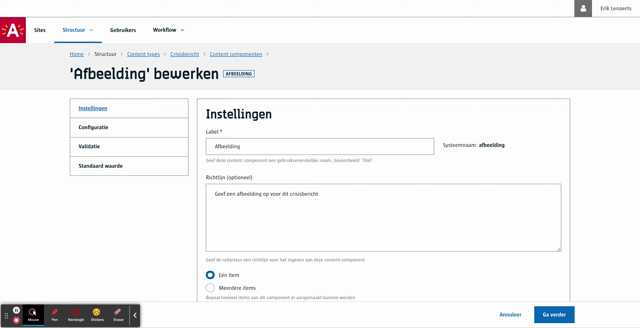

# Afbeelding

Kies een afbeelding, beschrijf het en stel de crop instellingen in.

> Zorg ervoor dat de [Assets module](/modules/content/modules/module-assets) geactiveerd is.

## Voor contentbeheerders

* stel toegelaten bestand extensies in
* geef min hoogte en breedte zodat de redacteurs images uploaden met een minimum kwaliteit
* crop / bijsnijden
  * Stel één of meerder crops.
  * De redacteur zal voor elke crop een keuze moeten maken
  * keuze uit
    * Vrije crop: de redacteur kan een uitsnede kiezen
    * **Begrensd**, de redacteur kan een uitsnede kiezen, met een max hoogte/breedte.
    * Ratio: de redacteur kan een uitsnede kiezen waarbij de verhouding tussen hoogte en breedte gelijk blijft
    * **Exact**: de redacteur kan een uitsnede kiezen maar de maten staan vast
* geef aan of het als decoratief beeld kan gebruikt worden. Bijvoorbeeld als afbeelding bovenaan in de pagina hoofding of als afbeelding in een kaartweergave voor een oplijsting, etc
* geef aan of de redacteur een zoom-in of zoom-out effect mag instellen.
* geef aan of de redacteur een focus punt kan toevoegen.

> [!Info|label:Performantie tip]
>
> We raden aan om steeds de crop opties `Begrensd` en `Exact` te gebruiken.
> Deze zijn evenwaardig aan de Vrije crop en Ratio crop respectievelijk, alleen zullen de eerste ook de image resizen naar de maximum ingestelde pixegrootte.
> Op die manier kan je de bestandsgrootte in één keer verkleinen wat de performantie (over het netwerk) ten goede zal komen.



([Bekijk dit op YouTube](https://youtu.be/4qVawwLCHnU ':target="_blank"'))

## Voor redacteurs

Je kan een afbeelding uploaden of kiezen uit een lijst van reeds opgeladen afbeeldingen
Je krijgt een preview van de afbeelding die je gekozen hebt


([Bekijk dit op YouTube](https://youtu.be/XqYR2Klnikc ':target="_blank"'))

## Voor ontwikkelaars

Als je een [content item ophaalt via de Content API](/wcmv4/content/content-item-read) krijg je onderstaande data terug.

### Lege output

```json
{
   "_id": "60e5abd49cc9940009fbf124",
   "fields": {
       "afbeelding": ""
   },
   "meta": {
      ...
   },
   ...
}
```

### Output met een afbeelding

Je krijgt zowel de `original` image alsook de data van de `crops` terug.

Met de `uuid` kan je de afbeelding effectief ophalen via de [Assets API](/wcmv4/content/assets).

> [!Warning|label:Afbeeldingkeuze]
>
> We raden het gebruik van de `original` afbeelding af. Werk in de frontend steeds met één van de `crop` afbeeldingen daar deze geöptimaliseerd zijn.
> Dikwijls komen de verschillende crops overeen met een bepaald schermformaat.

```json
{
   "_id": "60e5abd49cc9940009fbf124",
   "fields": {
        "afbeelding": {
            "meta": {
                "name": "Mijn afbeelding",
                "alt": "Mijn afbeelding",
                "title": "Mijn afbeelding",
                "description": "omschrijving",
                "copyright": "",
                "figuratively": true
            },
            "original": {
                "asset": {
                    "mime": "image/jpeg",
                    "uuid": "4ed0c27a-1b38-4718-9bce-7f0dadda48c5",
                    "size": {
                        "height": 1305,
                        "width": 2320
                    },
                    "fileName": "IMG_20210925_155306-2.jpg"
                }
            },
            "crops": {
                "small": {
                    "asset": {
                        "fileName": "IMG_20210925_155306-2.jpg",
                        "mime": "image/jpeg",
                        "size": {
                            "width": 1740,
                            "height": 1305
                        },
                        "uuid": "774522b9-31e2-4c05-b17f-faa183218963"
                    },
                    "cropValues": {
                        "x": 290,
                        "y": 0,
                        "width": 1740,
                        "height": 1305
                    },
                    "transformValues": {
                        "grayscale": false,
                        "blur": 0,
                        "rotate": 0
                    },
                    "renderValues": {
                        "zoomIn": {
                            "end": {
                                "y": 254.93784498645408,
                                "x": 520.4672897136303,
                                "height": 248.06215501354583,
                                "width": 660.3483609605128
                            },
                            "start": {
                                "width": 1339,
                                "height": 503,
                                "y": 0,
                                "x": 0
                            }
                        },
                        "focalPoint": {
                            "area": "center center"
                        }
                    },                    
                },
                "medium": {
                    "asset": {
                        "fileName": "IMG_20210925_155306-2.jpg",
                        "mime": "image/jpeg",
                        "size": {
                            "width": 2320,
                            "height": 1160
                        },
                        "uuid": "c03ac0fb-d9cd-4678-9f60-a1d72ed70903"
                    },
                    "cropValues": {
                        "x": 0,
                        "y": 73,
                        "width": 2320,
                        "height": 1160
                    },
                    "transformValues": {
                        "grayscale": false,
                        "blur": 0,
                        "rotate": 0
                    }
                },
                "large": {
                    ...
                },
                "extra-large": {
                    ...
                }
            }
        }
   },
   "meta": {
      ...
   },
   ...
}
```

?> Ga terug naar het [overzicht van alle content componenten](/redactie/content/inrichten-cc-standaard.md)
