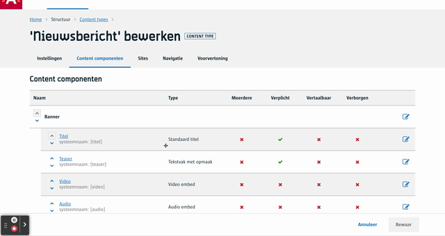
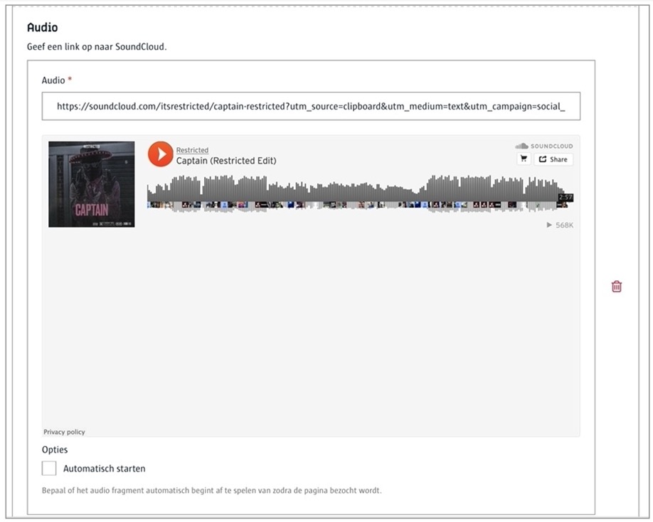

# Audio embed
Geef een url van een audiofragment - momenteel enkel op SoundCloud. Dit werkt heel gelijkaardig zoals een [video embed](/redactie/content/inrichten-cc-video-embed.md) component.

# Voor contentbeheerders
De enigste configuratie optie is om aan te geven aan de frontend dat een audiofragment automatisch mag afgespeeld worden.



([Bekijk dit op YouTube](https://youtu.be/GwoYSWYDC0E ':target="_blank"'))

# Voor redacteurs
Een redacteur kan eenvoudigweg een link van SoundCloud plakken in het voorziene vak en er komt een preview zodat de redacteur kan zien / horen of de juiste link geplakt is.



# Voor ontwikkelaars
```json
{
   "_id": "616056f8ce65be000a546530",
   "fields": {
       "audio": {
           "opties": [
               "autoplay"
           ],
           "audio": "https://soundcloud.com/...-tegen-geluidsoverlast"
       }
   },
   "meta": {
      ...
   },
   ...
}
```

?> Ga terug naar het [overzicht van alle content componenten](/redactie/content/inrichten-cc-standaard.md)