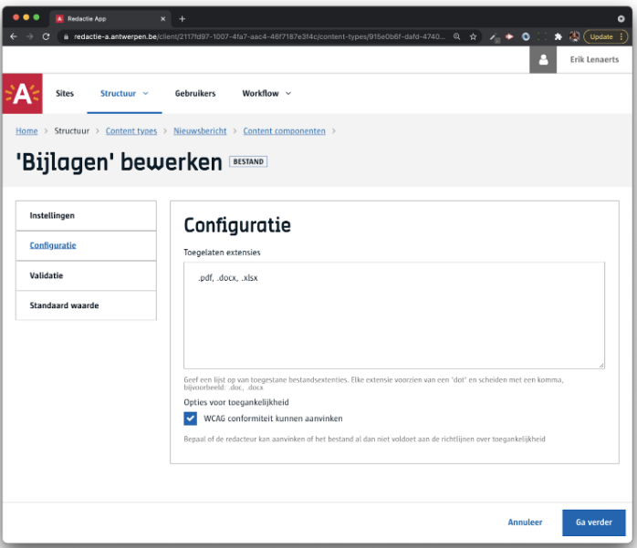
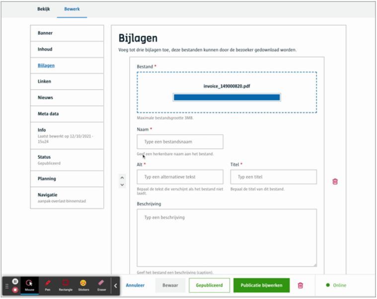
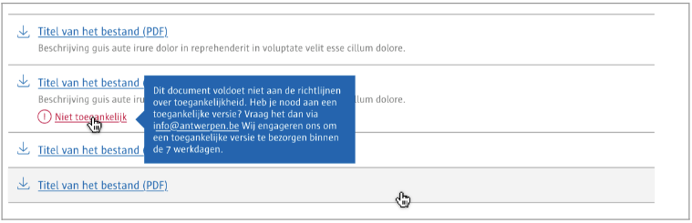

# Bestand
Laat toe om een **bestand** toe te voegen aan je content dat later aan de bezoekers als een **download** optie kan aangeboden worden in een frontend. 

# Voor content beheerders
- je bepaalt de toegelaten bestand extensies, zo kan je configureren dat enkel .pdf bestanden voorzien kunnen worden door de redacteurs.
- Je bepaalt of een redacteur kan aangeven of het bestand WCAG compliant is of niet.



# Voor redacteurs
- Je kan een bestand **uploaden** met de beperkingen ingesteld door de content beheerder
- Je geeft het bestand een naam, titel, omschrijving en optioneel kan je het aanduiden of het WCAG compliant is.



([Bekijk dit op YouTube](https://youtu.be/VTKk23YuDF4 ':target="_blank"'))

# Voor ontwikkelaars

## Lege output
```json
{
   "_id": "60fa91e443f907000a03283c",
   "modulesData": {
       "navigation": {
           "navigationTree": "1644",
           "id": 140275
       }
   },
   "fields": {
       "bijlagen": []
   },
   "uuid": "a520065b-9c69-45f1-86d7-4cb06f0e4ffd"
}
```

## Output met bestand(en)

Hieronder zie je een voorbeeld, in dit geval is er gekozen om één of meerdere bijlage te voorzien, vandaar de json array.

```json
{
   "_id": "60fa91e443f907000a03283c",
   "modulesData": {
       "navigation": {
           "navigationTree": "1644",
           "id": 140275
       }
   },
   "fields": {
       "bijlagen": [
           {
               "value": {
                   "wcag": [
                       "invalid"
                   ],
                   "description": "Factuur van xyz",
                   "title": "Factuur",
                   "alt": "Factuur",
                   "name": "Factuur",
                   "file": {
                       "mime": "application/pdf",
                       "name": "invoice_149000820.pdf",
                       "uuid": "ab6c5598-056b-48c5-a0d9-8934983bf1e1"
                   }
               },
               "uuid": "6a3ee190-41f8-4e2d-8ae7-91e6eddec202"
           }
       ]
   },
   "meta": {
      ...
   },
   "uuid": "a520065b-9c69-45f1-86d7-4cb06f0e4ffd"
}
```

# Voor bezoekers


[A-Stad ontwerpen](https://xd.adobe.com/view/2266b523-5427-400b-57f1-d24fad05f06c-5457/screen/13c1a144-fb59-4d33-a203-e5fcd38d9d38/)

?> Ga terug naar het [overzicht van alle content componenten](/redactie/content/inrichten-cc-standaard.md)