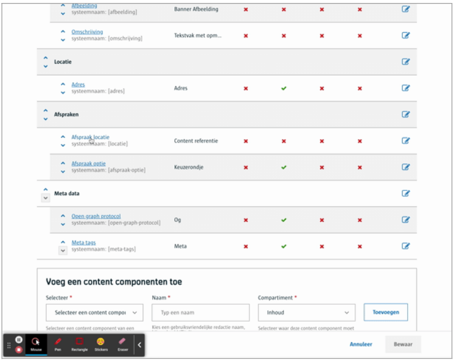
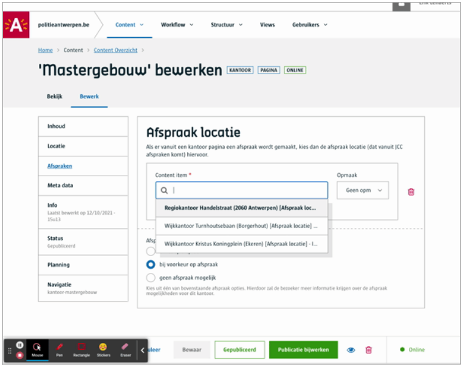
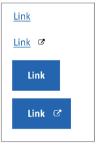

# Content referentie (interne link)

Wanneer je relaties wil leggen tussen content kan je gebruik maken van een content referentie. Je **verwijst** m.a.w. naar een ander content item.
 
# Voor content beheerders
- Bepaal de content types welke gebruikt mogen worden als referentie
- Bepaal het gedrag van een content referentie voor frontend afnemers, i.e.:
    - geef aan waar een link (waar deze referentie naar verwijst) geopend moet worden, bv een nieuw tabblad
    - geef aan of de link (waar deze referentie naar verwijst) moet getoond worden als knop, hyperlink


**Merk op**: van zodra je meerder opties kiest, zal de redacteur uit deze meerdere opties kunnen kiezen. Bijgevolg, kies je maar één optie, dan zal er geen keuze verschijnen voor de redacteur.




([Bekijk dit op YouTube](https://youtu.be/pp-rpcQxfx0':target="_blank"'))

# Voor redacteurs

Als je een verwijzing wil leggen, kan je uit een lijst kiezen of je kan zoeken naar een content item op basis van de titel ervan.



([Bekijk dit op YouTube](https://youtu.be/W7cxtP7vYAE ':target="_blank"'))

# Voor ontwikkelaars

## Lege output
```json
{
   "_id": "60e5abd49cc9940009fbf124",
   "fields": {
       "locatie": ""
   },
   "uuid": "05711d21-47da-49fc-ae37-29229b9bd13f"
}
```

## Output met een content referentie

```json
{
   "_id": "60e5abd49cc9940009fbf124",
   "fields": {
       "locatie": {
           "style": "link",
           "content": "870a8354-29b3-46a1-8352-c749e7f4dcaa",
           "target": "_self"
       }
   },
   "uuid": "05711d21-47da-49fc-ae37-29229b9bd13f"
}
```

## Output met een content referentie (populated)

Je kan de inhoud van het content item waar je naar verwijst, meteen mee ophalen, hiervoor gebruik je een &populate=locatie parameter in je API call. Lees de WCMv4 Content API documentatie voor [meer info over populeren](https://docs.google.com/document/d/1cMGpDkgqBnVhzlr7nr00YK8xciIESvIX1YmffqT6VzE/edit#heading=h.31k3e2vxxijw).

```json
{
   "_id": "60e5abd49cc9940009fbf124",
   "fields": {
       "locatie": {
           "style": "link",
           "content": {
               "_id": "6101245895259800090fe3a8",
               "fields": {
                   "referentienummer": 2,
                   "titel": {
                       "text": "Wijkkantoor Turnhoutsebaan (Borgerhout)",
                       "textType": "h1"
                   }
               },
               "meta": {
                   "label": "Wijkkantoor Turnhoutsebaan (Borgerhout)",
                   "status": "PUBLISHED",
                   "publishTime": null,
                   "site": "85c0b6d0-a800-4bc8-8215-a92869dded22",
                   "lastEditor": "b2f779e2-7bbf-459f-a931-a7c43d8863ae",
                   "firstPublished": "2021-07-28T09:33:12.944Z",
                   "parents": {
                       "views": [],
                       "content": [
                           {
                               "slug": "kantoor-mastergebouw",
                               "contentTypeLabel": "kantoor",
                               "contentType": "60d206a91bd2ac000abfcdd8",
                               "uuid": "05711d21-47da-49fc-ae37-29229b9bd13f",
                               "ref": "60e5abd49cc9940009fbf124"
                           }
                       ]
                   },
                   "deleted": false,
                   "hasDetail": false,
                   "activeLanguages": [
                       "nl"
                   ],
                   "hitCount": 0,
                   "hasScheduled": false,
                   "published": true,
                   "lastModified": "2021-07-28T09:33:12.922Z",
                   "created": "2021-07-28T09:33:12.922Z",
                   "taxonomy": {
                       "tags": []
                   },
                   "slug": "wijkkantoor-turnhoutsebaan-borgerhout",
                   "historyRef": "c4b81c39-a990-4d35-a712-1db03b77d0df",
                   "contentType": "afspraak_locatie"
               },
               "uuid": "870a8354-29b3-46a1-8352-c749e7f4dcaa"
           },
           "target": "_self"
       }
   },
   "meta": {
      ...
   },
   "uuid": "05711d21-47da-49fc-ae37-29229b9bd13f"
}
```
In dit voorbeeld is de content referentie naar een [contentblok](/common/content/concept-cb.md).

# Voor bezoekers


[A-Stad ontwerpen](https://xd.adobe.com/view/2266b523-5427-400b-57f1-d24fad05f06c-5457/screen/3fbce778-d33c-42b3-9bce-304b83118fdf/)

?> Ga terug naar het [overzicht van alle content componenten](/redactie/content/inrichten-cc-standaard.md)