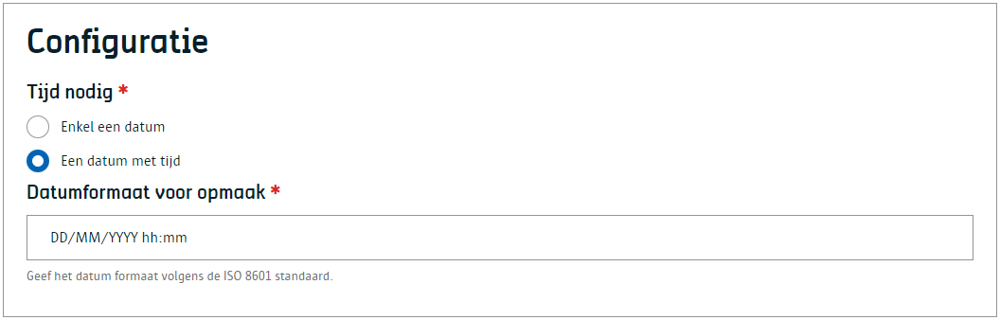
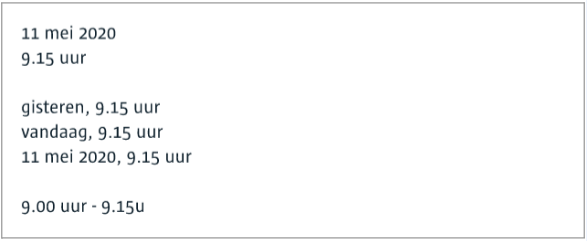

# Datum en tijd
Net zoals een datum component, maar deze keer kan er eveneens een tijd gekozen worden.

# Voor content beheerders
Er zijn geen configuratie opties voor de contentbeheerder.

# Voor redacteurs
Als redacteur kan je de datum, het uur en de minuten kiezen. Merk op dat je niet per minuut maar per 5 minuten kan werken.

# Voor ontwikkelaars
Hieronder is een voorbeeld waar je een tijdstip in [ISODate](https://www.iso.org/iso-8601-date-and-time-format.html) kan terugvinden.

# Voor bezoekers

?> Ga terug naar het [overzicht van alle content componenten](/redactie/content/inrichten-cc-standaard.md)