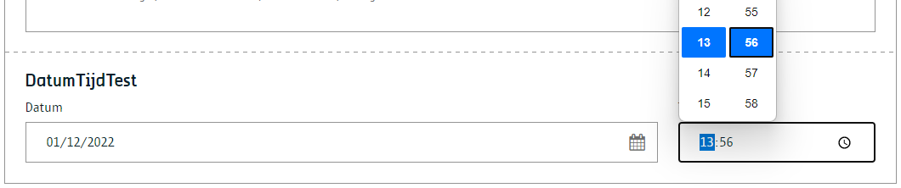

# Datum en tijd

Net zoals een datum component, maar deze keer kan er eveneens een tijd gekozen worden.

> [!Warning|label:Opgelet]
>
> Vanaf WCMv4 zal de content component 'Datum' niet verder worden ondersteund. Gelieve steeds de content component 'Datum en tijd' te gebruiken.

## Voor content beheerders

Als content beheerder kan je :

* Instellen of er enkel met datum of met datum en tijd kan worden gewerkt.
* Het datumformaat (volgens [ISO 8601](https://www.iso.org/iso-8601-date-and-time-format.html) standaard) configureren.


## Voor redacteurs

Als redacteur kan je de datum, het uur en de minuten ingeven.



## Voor ontwikkelaars

Hieronder is een voorbeeld waar je een tijdstip in [ISODate](https://www.iso.org/iso-8601-date-and-time-format.html) kan terugvinden.

## Output met datum-tijdinput

```json
{
    "_id": "639b2607f07ca50007092544",
    "fields": {
        "datum-tijd-test": "2022-12-01T12:56:00.000Z"
        },
    "uuid": "2e038d59-aa5b-4744-8b36-dd3823347396",
    ...
}
```

## Voor bezoekers


?> Ga terug naar het [overzicht van alle content componenten](/redactie/content/inrichten-cc-standaard.md)
