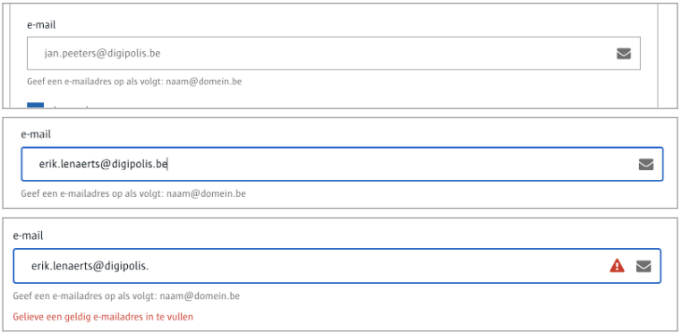
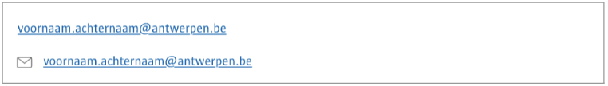

# Email
Voor de invoer van **geldige e-mail** adressen.

# Voor content beheerders
Je kan enkel een placeholder tekst voorzien.

# Voor redacteurs
De placeholder is in lichtgrijs en dient als voorbeeld.
Bij de invoer wordt er nagegaan of het een geldig e-mail adres is.




# Voor ontwikkelaars

```json
{
   "_id": "616588e5ce65be000a5466eb",
   "fields": {
       "e-mail": "erik.lenaerts@digipolis.be"
   },
   "uuid": "4c370038-2417-483a-a3df-1acd57742e60", 
   ...
}
```


# Voor bezoekers


[A-Stad ontwerpen](https://xd.adobe.com/view/2266b523-5427-400b-57f1-d24fad05f06c-5457/screen/7b647498-86c7-4324-b032-152cf181bb36/)


?> Ga terug naar het [overzicht van alle content componenten](/redactie/content/inrichten-cc-standaard.md)