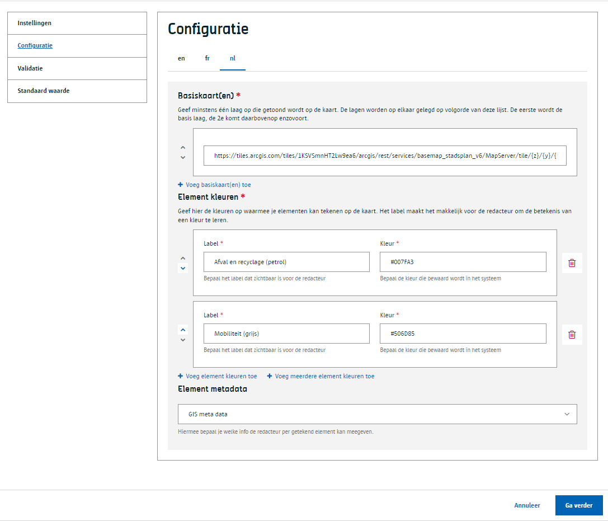
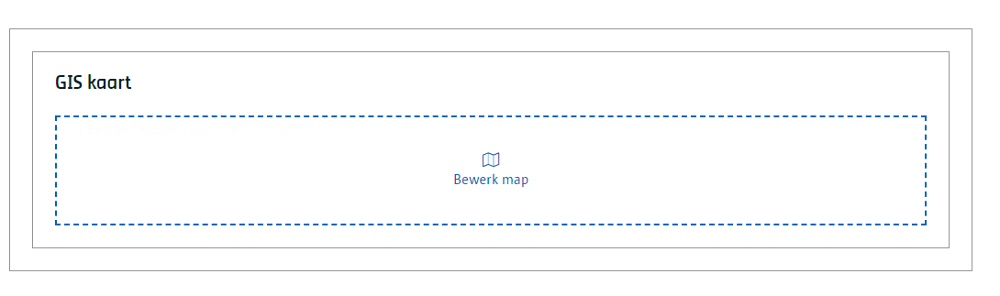
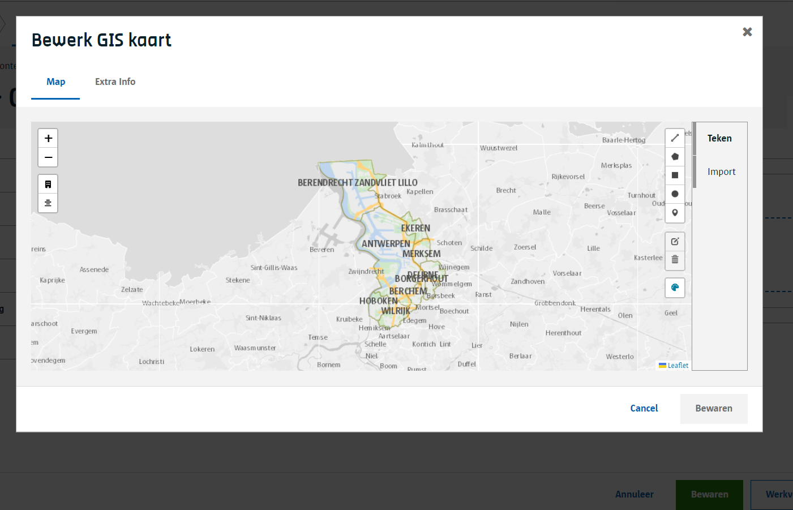
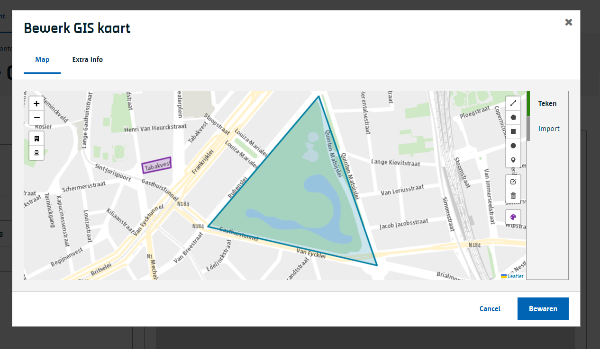
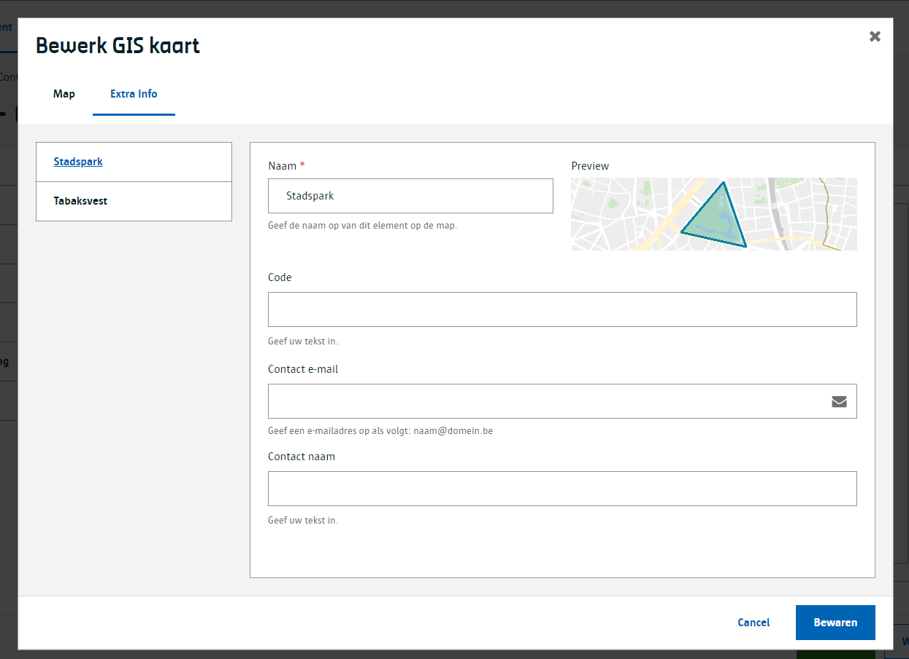
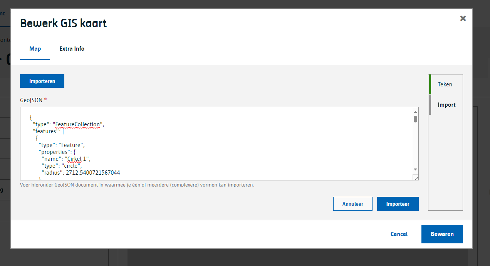

# GIS kaart

Laat toe om een GEO kaart te kiezen en hierop elementen te tekenen.

> Zorg ervoor de de [GIS module](/modules/content/modules/module-gis) geactiveerd is.

## Voor content beheerders

Je kan 3 zaken configureren wanneer je een GIS kaart content component op je content type zet:

- GIS basiskaarten
- Element kleuren
- Extra velden per element

### GIS basiskaarten

De GIS basiskaarten bepaalt wat de redacteur ziet wanneer hij/zij de GIS kaart content component bewerkt.

Standaard is volgende basiskaart voorzien die de Vlaanderen in beeld brengt en specifiek Antwerpen daarboven in kleur zet:

[Vlaanderen als grijze achtergrond en Antwerpen in kleur](https://tiles.arcgis.com/tiles/1KSVSmnHT2Lw9ea6/arcgis/rest/services/basemap_stadsplan_v6/MapServer/tile/{z}/{y}/{x})

```shell
https://tiles.arcgis.com/tiles/1KSVSmnHT2Lw9ea6/arcgis/rest/services/basemap_stadsplan_v6/MapServer/tile/{z}/{y}/{x}
```  

Wil je de hele wereld in een grijze achtergrond dan kan je deze basiskaart configureren:
  
[De wereld als grijze achtergrond](https://services.arcgisonline.com/ArcGIS/rest/services/Canvas/World_Light_Gray_Base/MapServer/tile/{z}/{y}/{x})

```shell
https://services.arcgisonline.com/ArcGIS/rest/services/Canvas/World_Light_Gray_Base/MapServer/tile/{z}/{y}/{x}
```  

> [!info|label:Opmerking]
> Je kan verschillende basiskaarten als lagen op elkaar leggen. Wil je bijvoorbeeld zowel de wereld in't grijs en Antwerpen gekleurd daarboven dan gebruik je beide basiskaarten.

### Element kleuren

Als content beheerder kan je verschillende kleuren configureren. De redacteur kan per element dat hij/zij tekent de kleur kiezen.

Standaard hebben we volgende kleuren voorzien.

| Naam                        | HEX    |
|-----------------------------|--------|
| Afval en recyclage (petrol) | 007FA3 |
| Mobiliteit (grijs)          | 506D85 |
| Gezondheid (blauw)          | 0057B7 |
| Sporten en bewegen (groen)  | 007B5F |
| Kinderen en jeugd (paars)   | 8031A7 |
| Onderwijs (wijnrood)        | 840B55 |
| Cultuur (oranje)            | C05131 |
| Dienstverlening (stadsrood) | CF0039 |

### Extra velden per element

Als content beheerder kan je een [samengesteld content component](/common/content/concept-cc?id=standaard-samengesteld-en-custom) toevoegen aan een GIS kaart.
Dit component zal getoond worden aan de redacteurs waar ze de extra informatie kunnen invoeren per getekend element.



## Voor redacteurs

Als redacteur krijg je de optie om een GIS kaart toe te voegen.



Je krijgt de GIS kaart editor en je de kaart zien die de content beheerder voor je heeft ingesteld. Standaard is het de kaart die Vlaanderen in't grijs toont en Antwerpen daarop gekleurd.

.

Aan de rechterkant van de kaart bevinden zich de teken tools zoals een cirkel een polygoon, etc. Afhankelijk van wat de content beheerder heeft ingesteld kan je met één of meerdere kleuren tekenen.

.

Per element dat je tekent kan je de naam aanpassen en extra informatie voorzien. Deze extra info is per getekend element hetzelfde maar kan per [content type](/common/content/concept-ct) verschillen.

.

Je kan ook reeds eerder getekende elementen importeren, hiervoor moet de import wel voldoen aan het [GeoJSON](https://geojson.org/) standaard formaat.

.

## Voor ontwikkelaars

### Lege output

```json
{
    "_id": "65a94d1c396a9a34304c2334",
    "uuid": "d2d8679a-3a5e-4ff6-a351-67becd6f5b7b",
    "fields": {
        "gis-kaart": ""
    },
    "modulesData": {}
}
```

### Output met een getekend element op de GIS kaart

Het content component in dit voorbeeld heeft de naam `gis-kaart`. Hierin zitten 2 luiken

`mapControls`: hier zitten gegevens die je nodig hebt voor de kaart zelf te renderen. De positie en de zoom dat de redacteur instelde toen hij/zij de GIS kaart afsloot worden hierin vastgelegd.
Zo kan de frontend kiezen om dit over te nemen bij de presentatie van de kaart

`mapData`: hier zit de GeoJSON data in met de getekende elementen.

Hier is een volledig voorbeeld:

```json
{
    "_id": "659d60edae970038264276cc",
    "uuid": "dac8e1ce-8b6c-437a-9191-c8981ba19a28",
    "fields": {
        "gis-kaart": {
            "mapControls": {
                "latLng": {
                    "lat": 51.23462231776156,
                    "lng": 4.424743652343751
                },
                "zoom": 13
            },
            "mapData": {
                "type": "FeatureCollection",
                "features": [
                    {
                        "type": "Feature",
                        "properties": {
                            "id": 213,
                            "type": "polygon",
                            "color": {
                                "label": "Afval en recyclage (petrol)",
                                "value": "#007FA3"
                            },
                            "dimensions": {
                                "area": 5632544.62,
                                "perimeter": 10088.43,
                            },
                            "name": "Veelhoek 1",
                            "fields": {
                                "code": {
                                    "textType": "div",
                                    "text": "ABCDE"
                                },
                                "contact-e-mail": "erik.lenaerts@digipolis.be",
                                "contact-naam": {
                                    "textType": "div",
                                    "text": "Erik Lenaerts"
                                }
                            }
                        },
                        "geometry": {
                            "type": "Polygon",
                            "coordinates": [
                                [
                                    [ 4.431975, 51.22828 ],
                                    [ 4.431975, 51.24322 ],
                                    [ 4.480566, 51.24322 ],
                                    [ 4.480566, 51.22828 ],
                                    [ 4.431975, 51.22828 ]
                                ]
                            ]
                        }
                    }
                ]
            }
        }
    },
    "modulesData": {}
}
```

#### GeoJSON vs custom data

mapData bevat de GeoJSON data. Hier kan je 3 verschillende onderdelen in terugvinden:

A. standaard GeoJSON data volgens de [RFC7946](https://datatracker.ietf.org/doc/html/rfc7946) specificatie
B. extra vaste informatie van elk getekend element `properties` element
C. extra variabele informatie die de redacteur per [getekent element kan invoeren](/redactie/content/inrichten-cc-gis-kaart?id=extra-velden-per-element).

Laten we deze 3 eens in beeld brengen.

##### Standaard GeoJSON data per getekend element

Dit is een voorbeeld van de standaard GeoJSON data. Het bevat een `type` en `geometry` element.

```json
{
    "type": "FeatureCollection",
    "features": [
        {
            "type": "Feature",
            "properties": { ...},
            "geometry": {
                "type": "Polygon",
                "coordinates": [
                    [
                        [ 4.431975, 51.22828 ],
                        [ 4.431975, 51.24322 ],
                        [ 4.480566, 51.24322 ],
                        [ 4.480566, 51.22828 ],
                        [ 4.431975, 51.22828 ]
                    ]
                ]
            }
        }
    ]
}
```

##### Extra vaste informatie per getekend element

Wanneer redacteurs tekenen op de GIS kaart kunnen ze onder meer de naam en de kleur bepalen. Deze informatie is steeds aanwezig en bewaren we in de `properties` van de GeoJSON data structuur.
Concreet bewaren we deze properties:

- `id`: Een unieke id voor het getekend element.
- `type`: Het type van wat we getekend hebben. Dit is verschillend van de info die in het GeoJSON geometry element zit. Zo kent de GeoJSON spec geen cirkel. Vandaar dat we dit zelf hier bijhouden.
  Hier is het verband tussen beide:
    | GIS kaart type 	| GeoJSON type 	|
    |----------------	|--------------	|
    | **point**      	| Point        	|
    | **line**       	| LineString   	|
    | **rectangle**  	| Polygon      	|
    | **polygon**    	| Polygon      	|
    | **cirkel**     	| Point        	|  
- `name`: Dit is de naam die de redacteur aan het element gegeven heeft.
- `color`: Dit is de code en het label van de kleur waarmee het element getekend is.
- `dimensions`: Per getekend element berekenen we de dimensies en worden deze hier bewaard. De dimensies verschillen per type van het getekend element:
    | GIS kaart type 	| dimensions                                                            	|
    |----------------	|-----------------------------------------------------------------------	|
    | **point**      	| N/A                                                                   	|
    | **line**       	| `length`: lengte van de lijn                                          	|
    | **rectangle**  	| _wordt beschouwd als een polygon_                                     	|
    | **polygon**    	| `area`: oppervlakte<br/> `perimeter`: omtrek                          	|
    | **cirkel**     	| `radius`: de radius<br/> `area`: oppervlakte<br/> `perimeter`: omtrek 	|

```json
{
    "type": "FeatureCollection",
    "features": [
        {
            "type": "Feature",
            "properties": {
                "id": 213,
                "type": "polygon",
                "name": "Veelhoek 1",
                "color": {
                    "label": "Afval en recyclage (petrol)",
                    "value": "#007FA3"
                },
                "dimensions": {
                    "area": 5632544.62,
                    "perimeter": 10088.43,
                },
                "fields": { ... }
            },
            "geometry": { .. }
        }
    ]
}
```

##### Extra variabele informatie per getekend element

Als laatste tonen we waar de custom data staat per getekend element. Een redacteur geeft deze informatie in bij het tekenen van de elementen op de kaart.
Wat hij/zij kan invullen is [bepaald door de content beheerder](/redactie/content/inrichten-cc-gis-kaart?id=extra-velden-per-element).
In het onderstaande voorbeeld heeft de redacteur een code, email en naam opgegeven.

```json
{
    "type": "FeatureCollection",
    "features": [
        {
            "type": "Feature",
            "properties": {
                ...
                "fields": {
                    "code": {
                        "textType": "div",
                        "text": "ABCDE"
                    },
                    "contact-e-mail": "erik.lenaerts@digipolis.be",
                    "contact-naam": {
                        "textType": "div",
                        "text": "Erik Lenaerts"
                    }
                }
            },
            "geometry": { ... }
        }
    ]
}
```

?> [Bekijk hier](/frontend/content/geo-rendering?id=renderen-via-leaflet) hoe je best omgaat met het renderen van deze GIS kaart en de elementen erop.
