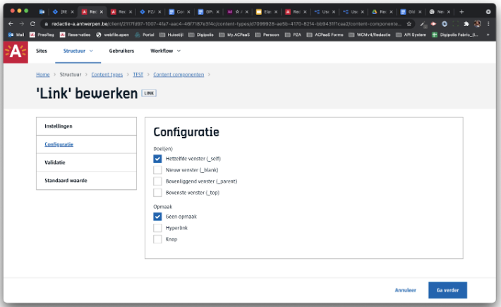
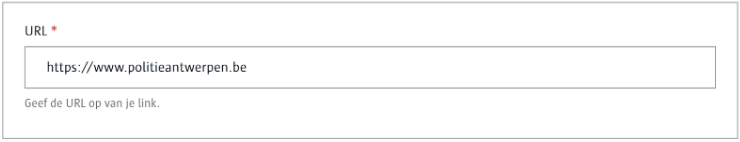
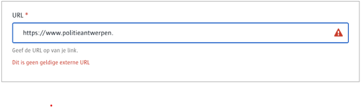
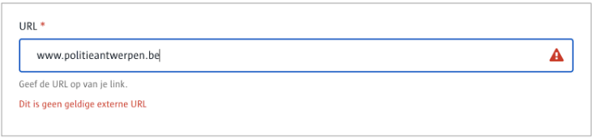
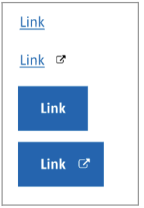

# GIS 

Laat toe om een **geldige link (url)** in te voeren.

## Voor content beheerders

* Bepaal het gedrag van een link voor frontend afnemers, i.e.:
  * geef aan waar de link geopend moet worden, bv een nieuw tabblad
  * geef aan of de link moet getoond worden als knop, hyperlink, ...

**Merk op**: van zodra je meerder opties kiest, zal de redacteur uit deze meerdere opties kunnen kiezen. Bijgevolg, kies je maar één optie, dan zal er geen keuze verschijnen voor de redacteur.



## Voor redacteurs

De invoer wordt gecontroleerd op een geldige url.





Merk op dat er een schema moet voorzien worden (http, https, …)



## Voor ontwikkelaars

### Lege output

```json
{
   "_id": "616588e5ce65be000a5466eb",
   "fields": {
       "link": ""
   },
   "uuid": "4c370038-2417-483a-a3df-1acd57742e60", 
   ...
}
```

### Output met een gekozen link

```json
{
   "_id": "616588e5ce65be000a5466eb",
   "fields": {
       "link": {
           "url": "https://www.politieantwerpen.be",
           "style": "none",
           "target": "_self"
       }
   },
   "uuid": "4c370038-2417-483a-a3df-1acd57742e60", 
   ...
}
```

## Voor bezoekers



[A-Stad ontwerpen](https://xd.adobe.com/view/2266b523-5427-400b-57f1-d24fad05f06c-5457/screen/3fbce778-d33c-42b3-9bce-304b83118fdf/)

?> Ga terug naar het [overzicht van alle content componenten](/redactie/content/inrichten-cc-standaard.md)
