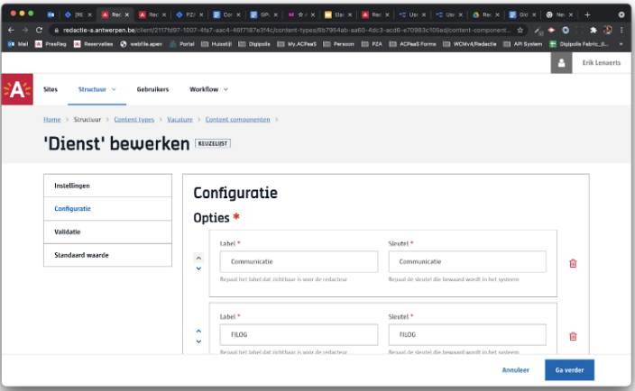
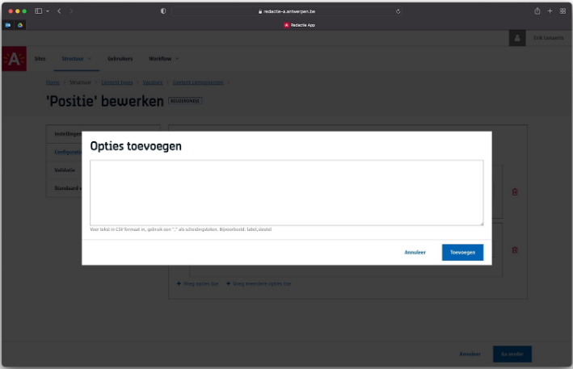
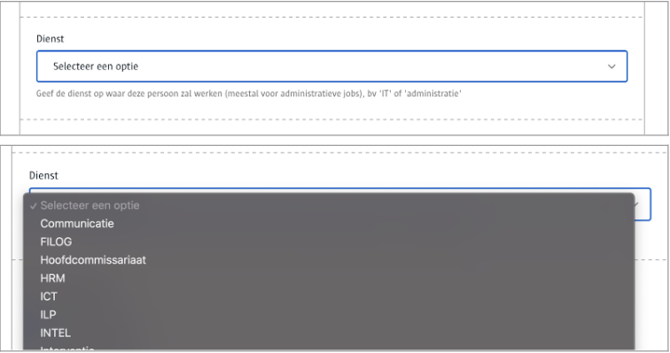

# Keuzelijst
Voorziet een **lijst** waaruit de redacteur kan kiezen.

# Voor content beheerders

Je geeft een lijst op van key/value pairs.



Nieuw in v4.2 is een extra optie waarbij je in bulk in één keer meerdere opties kan toevoegen.



# Voor redacteurs
Als redacteur kan je de datum, het uur en de minuten kiezen. Merk op dat je niet per minuut maar per 5 minuten kan werken.



# Voor ontwikkelaars

De waarde van het component is op basis van de sleutel/key. Het label komt niet in de api payload mee.

## Lege output

```json
{
   "_id": "60e34afee17227000bec60ea",
   "fields": {
       "dienst": ""
   },
   "uuid": "98a521f8-e1cc-4b7c-b095-5d9c16b9abba", 
   ...
}
```

## Output met gekozen waarden

```json
{
   "_id": "60e34afee17227000bec60ea",
   "fields": {
       "dienst": "Hoofdcommissariaat"
   },
   "uuid": "98a521f8-e1cc-4b7c-b095-5d9c16b9abba", 
   ...
}
```

# Voor bezoekers
NA

?> Ga terug naar het [overzicht van alle content componenten](/redactie/content/inrichten-cc-standaard.md)