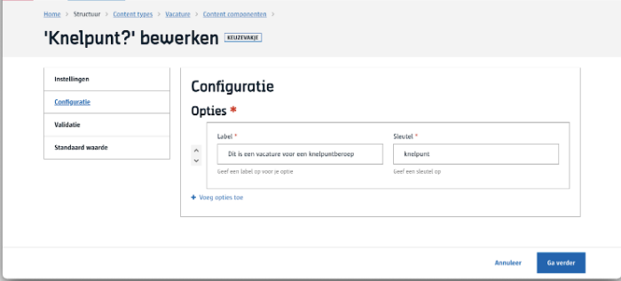
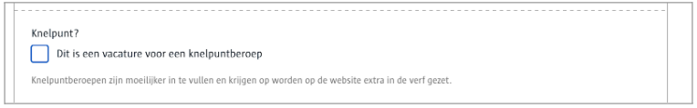

# Keuzelijst
Voorziet een **lijst** waaruit de redacteur kan kiezen.

# Voor content beheerders

Je geeft een lijst op van key/value pairs.



# Voor redacteurs

Je kan alle nul, één of meerdere keuze vakjes aankruisen.



# Voor ontwikkelaars

## Lege output

Ingeval er geen enkel keuzevakje is aangekruist.

```json
{
   "_id": "60e34afee17227000bec60ea",
   "fields": {
       "knelpunt": []
   },
   "uuid": "98a521f8-e1cc-4b7c-b095-5d9c16b9abba", 
   ...
}
```

## Output met gekozen opties

Voor elk aangekruist keuzevak, zal de key ervan opgelijst worden in een array.

```json
{
   "_id": "60e34afee17227000bec60ea",
   "fields": {
       "knelpunt": [
           "knelpunt"
       ]
   },
   "uuid": "98a521f8-e1cc-4b7c-b095-5d9c16b9abba", 
   ...
}
```

# Voor bezoekers
NA

?> Ga terug naar het [overzicht van alle content componenten](/redactie/content/inrichten-cc-standaard.md)