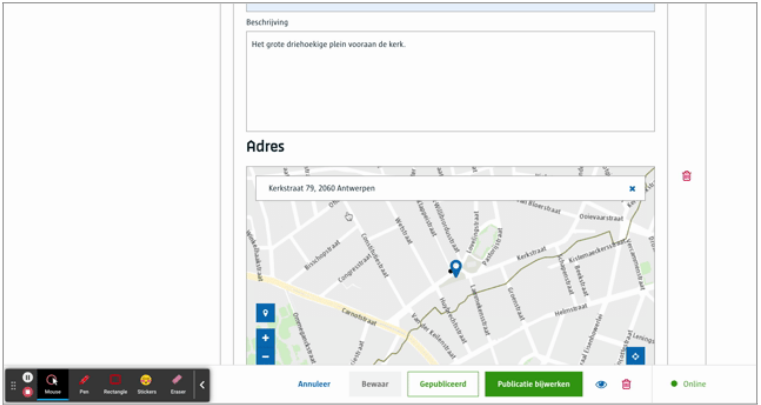
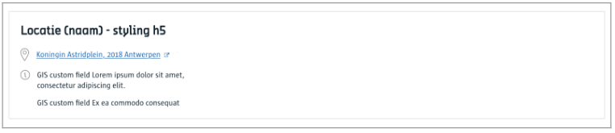

# Locatie

Een locatie is een adres met een extra titel en omschrijving, je kan dit gebruiken om bijvoorbeeld points of interest te laten invoeren zoals een zwembad of een kantoor.

Wil je enkel een straat of een adres, dan gebruik je de [Adres](/redactie/content/inrichten-cc-adres) component. 

# Voor content beheerders

Er zijn geen configuratie opties voor de contentbeheerder.

# Voor redacteurs

Geef een titel, omschrijving in voor een bijbehorend adres. Enkel de titel is verplicht.




([Bekijk dit op YouTube](https://youtu.be/vvcy9RjtQLU ':target="_blank"'))

# Voor ontwikkelaars

## Lege output
```json
{
   "_id": "616588e5ce65be000a5466eb",
   "fields": {
       "locatie": ""
   },
   "uuid": "4c370038-2417-483a-a3df-1acd57742e60", 
   ...
}
```

## Output met enkel een locatie titel

```json
{
   "_id": "616588e5ce65be000a5466eb",
   "fields": {
       "locatie": {
           "titel": {
               "text": "Plein achter de kerk",
               "textType": "div"
           }
       }
   },
   "uuid": "4c370038-2417-483a-a3df-1acd57742e60", 
   ...
}
```

## Output met een locatie titel en omschrijving

```json
{
   "_id": "616588e5ce65be000a5466eb",
   "fields": {
       "locatie": {
           "beschrijving": "<p>Het grote driehoekige plein vooraan de kerk.</p>",
           "titel": {
               "text": "Plein achter de kerk",
               "textType": "div"
           }
       }
   },
   "uuid": "4c370038-2417-483a-a3df-1acd57742e60", 
   ...
}
```

## Output met een locatie titel, omschrijving en adres

```json
{
   "_id": "616588e5ce65be000a5466eb",
   "fields": {
       "locatie": {
        "adres": {
               "actualLocation": {
                   "lng": 4.431117,
                   "lat": 51.218763
               },
               "layer": "adres",
               "address": {
                   "distance": 21.234,
                   "addressPosition": {
                       "geometryMethod": "AfgeleidVanObject",
                       "lambert72": {
                           "y": 212072.4,
                           "x": 154364
                       },
                       "wgs84": {
                           "lng": 4.431218,
                           "lat": 51.218583
                       }
                   },
                   "houseNumber": {
                       "houseNumber": "74"
                   },
                   "street": {
                       "streetName": "Kerkstraat",
                       "streetNameId": 1514
                   },
                   "municipalityPost": {
                       "nisCode": 11002,
                       "postCode": "2060",
                       "antwerpDistrictCode": "AN",
                       "antwerpDistrict": "Antwerpen",
                       "municipality": "Antwerpen"
                   },
                   "crabAddressType": "hoofdadres",
                   "crabAddressId": 1015709,
                   "addressRegId": 1236112,
                   "id": 68939,
                   "formattedAddress": "Kerkstraat 74, 2060 Antwerpen"
               },
               "label": "Kerkstraat 74, 2060 Antwerpen"
           },
           "beschrijving": "<p>Het grote driehoekige plein vooraan de kerk.</p>",
           "titel": {
               "text": "Plein achter de kerk",
               "textType": "div"
           }
       }
   },
   "uuid": "4c370038-2417-483a-a3df-1acd57742e60", 
   ...
}
```

# Voor bezoekers


[A-Stad ontwerpen](https://xd.adobe.com/view/2266b523-5427-400b-57f1-d24fad05f06c-5457/screen/f4b7b726-9ef7-4844-9c1d-e4d065914a7e/)

?> Ga terug naar het [overzicht van alle content componenten](/redactie/content/inrichten-cc-standaard.md)