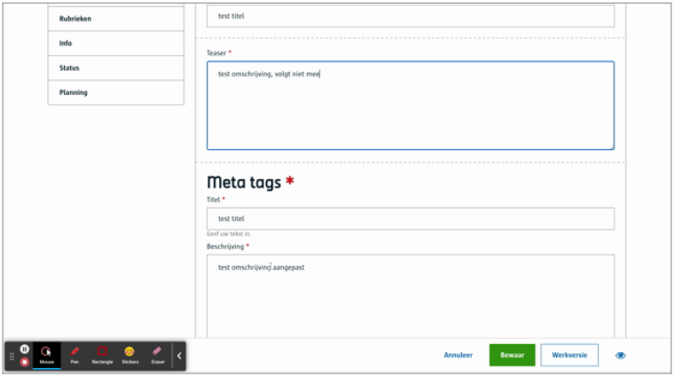

# Meta

Laat toe om **meta tags** op te geven alsook een **meta description**.

**Merk op**:
- Meta, wordt standaard voorzien voor nieuwe content types
- De meta info wordt standaard overgenomen van de titel en de teaser. Wanneer je dit zelf aanpast, zal dit vanaf dan de aangepaste versie zijn.


# Voor content beheerders

Er zijn geen configuratie opties voor de contentbeheerder.

# Voor redacteurs



([Bekijk dit op YouTube](https://youtu.be/_HpP7BVFrRI ':target="_blank"'))

# Voor ontwikkelaars

```json
{
   "_id": "616588e5ce65be000a5466eb",
   "fields": {
       "meta-tags": {
           "description": {
               "textType": "div",
               "text": "de meta omschrijving"
           },
           "title": {
               "textType": "h1",
               "text": "de titel"
                          }
       }
   },
   "uuid": "4c370038-2417-483a-a3df-1acd57742e60", 
   ...
}
```

# Voor bezoekers

NA

?> Ga terug naar het [overzicht van alle content componenten](/redactie/content/inrichten-cc-standaard.md)