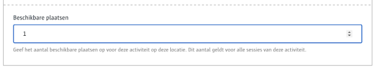

# Nummer

Laat toe om een **nummer** in te voeren.

# Voor content beheerders

Er zijn geen configuratie opties voor de contentbeheerder.

# Voor redacteurs

Je kan ofwel een nummer invoeren via het toetsenbord, ofwel via de up/down pijltjes achteraan het invoervak



# Voor ontwikkelaars

```json
{
   "_id": "60e6b1aeab7b36000947a534",
   "fields": {
       "beschikbare-plaatsen": 5
   },
   "uuid": "da26950c-1e6e-4782-9726-219cb9b3487b", 
   ...
}
```

# Voor bezoekers

NA

?> Ga terug naar het [overzicht van alle content componenten](/redactie/content/inrichten-cc-standaard.md)