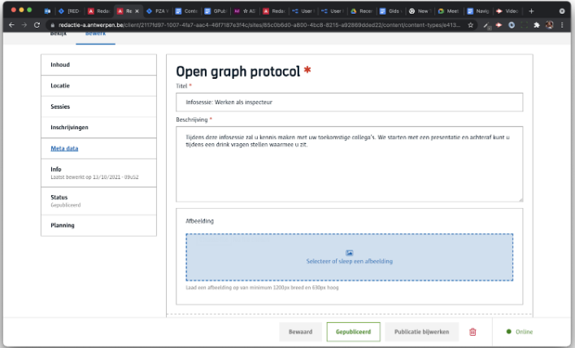

# Open graph (Og)

Laat toe om **Open Graph** informatie mee te geven bij dit content item.

**Merk op**:
- Og wordt standaard voorzien voor nieuwe content types
- Og info wordt standaard overgenomen van de titel en de teaser. Wanneer je dit zelf aanpast, zal dit vanaf dan de aangepaste versie zijn.

# Voor content beheerders

Er zijn geen configuratie opties voor de contentbeheerder.

# Voor redacteurs



Zeer gelijkaardig als [meta](redactie/content/inrichten-cc-meta.md), de titel en beschrijving volgen de titel van het content item en de teaser. 


# Voor ontwikkelaars

```json
{
   "_id": "60e6b1aeab7b36000947a534",
   "fields": {
       "open-graph-protocol": {
           "image": "",
           "description": {
               "textType": "div",
               "text": "Tijdens deze infosessie zal u kennis maken met uw toekomstige collega's. We starten met een presentatie en achteraf kunt u tijdens een drink vragen stellen waarmee u zit."
           },
           "title": {
               "textType": "h1",
               "text": "Infosessie: Werken als inspecteur"
           }
       }
   },
   "uuid": "da26950c-1e6e-4782-9726-219cb9b3487b", 
   ...
}
```

# Voor bezoekers

NA

?> Ga terug naar het [overzicht van alle content componenten](/redactie/content/inrichten-cc-standaard.md)