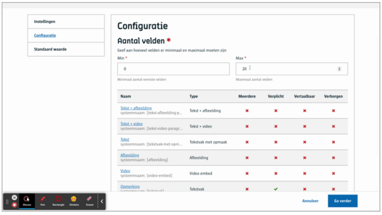

# Paragraaf

Geeft de redacteur de mogelijkheid om **zelf een content component te kiezen**. Dikwijls kan een redacteur meerdere paragrafen opstellen bestaande uit verschillende content componenten. 

# Voor content beheerders
-Je bepaalt hoeveel paragrafen er mogen toegevoegd door de redacteur (min, max)
-je bepaalt uit welke content componenten de redacteur mag kiezen.



([Bekijk dit op YouTube](https://youtu.be/sWUjN6iNbX4 ':target="_blank"'))

# Voor redacteurs


([Bekijk dit op YouTube](https://youtu.be/D-xsbH-9wPg ':target="_blank"'))

# Voor ontwikkelaars
Paragrafen zijn in essentie verschillende json objecten verzameld in één array.
```json
{
   "_id": "60f8640343f907000a0327f1",
   "fields": {
       "inhoud": [
           {
               "value": "Het wordt vooral gebruikt in de voedingsindustrie (bv. slagroompatronen), de technische industrie...",
               "uuid": "11cb5aaa-ddd6-498d-8fdc-50e001279cea",
               "type": "ckeditor",
               "fieldRef": "775d97ba-25ed-4f26-8a87-2bba3f0937d8",
               "fieldType": "19940420-be03-435d-8b36-a1d4c8fa2fdd",
               "semanticType": "tekstvak-met-opmaak",
               "multiple": false
           },
           {
               "multiple": false,
               "semanticType": "video-embed",
               "preset": "80ffa630-2f19-4334-aff9-8d3fb555fb8b",
               "fieldType": "07d930ac-6094-45de-a53d-c57f4dd0fdb6",
               "fieldRef": "32507f59-e92b-4971-97f4-14163e84e5ae",
               "type": "fieldgroup",
               "uuid": "cff044d5-48bc-4e7c-ba2a-695b4b89718c",
               "value": {
                   "video": "https://www.youtube.com/watch?v=Q9C9Q45rliY"
               }
           },
           {
               "value": {
                   "textType": "alert-warning",
                   "text": "Opmerking: Nulla eu ornare mi..."
               },
               "uuid": "ab6acc3f-77f8-4a3f-81d8-7fd18950a21a",
               "type": "textareaWithStyle",
               "fieldRef": "4ac4e2ef-bd65-4c3b-a5cc-62575e9960c4",
               "fieldType": "06890d23-282a-4292-aa22-86dab36389f2",
               "semanticType": "tekstvak",
               "multiple": false
           },
           {
               "value": {
                   "textType": "div",
                   "text": "inzetstuk: ..."
               },
               "uuid": "4f33c07a-71b6-4cc4-a651-31250c7a402f",
               "type": "textareaWithStyle",
               "fieldRef": "08706c9e-a426-4597-9fb0-b1d346420875",
               "fieldType": "06890d23-282a-4292-aa22-86dab36389f2",
               "semanticType": "tekstvak",
               "multiple": false
           }
       ]
   },
   "uuid": "fa34c168-65e2-4b48-a72f-b71de45ca940", 
   ...
}
```

# Voor bezoekers

NA

?> Ga terug naar het [overzicht van alle content componenten](/redactie/content/inrichten-cc-standaard.md)