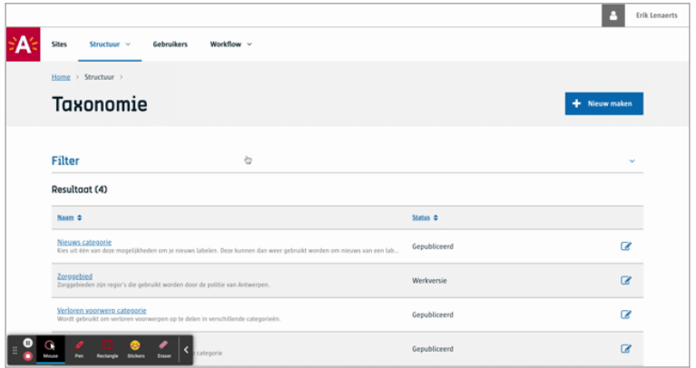
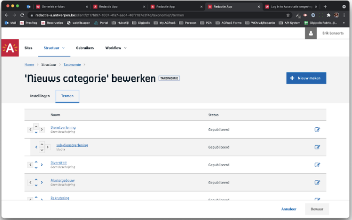
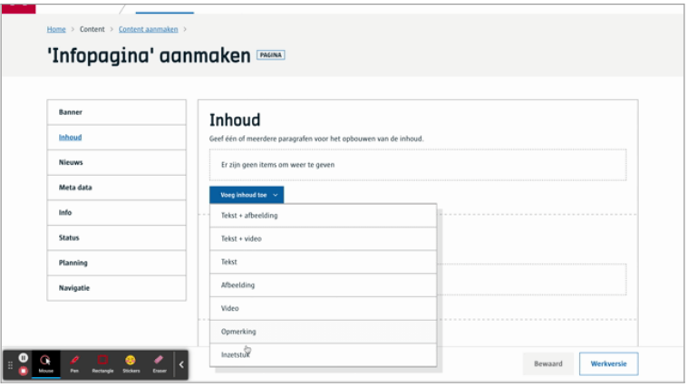

# Taxonomie
Hiermee geef je een redacteur de mogelijkheid om een content item te **klasseren of taggen**. Dikwijls wordt dit gebruikt om hiermee te kunnen filteren in een [view](/redactie/content/inrichten-cc-view.md), bijvoorbeeld, toon een pagina met een lijst van nieuwsberichten volgens een tag die de websitebezoeker heeft gekozen.

# Voor content beheerders
<<<<<<< HEAD
Vooraleer je een taxonomie kan gebruiken, zal je deze eerst moeten aanmaken. Het aanmaken kan je enkel op [tenant](https://docs.google.com/document/d/1Npgx9sR1cCf6mKrFynA3q6sIy9qENecNYd94WGqW8rU/edit#heading=h.vl3pwkiqjqrn) niveau.

## Taxonomie aanmaken

=======
Vooraleer je een taxonomie kan gebruiken, zal je deze eerst moeten aanmaken. Het aanmaken kan je enkel op **tenant** niveau. 

## Taxonomie aanmaken

>>>>>>> 1ed760afcd1ba904efd53aec9e787520d174694f

([Bekijk dit op YouTube](https://youtu.be/sWUjN6iNbX4 ':target="_blank"'))

## Taxonomie termen beheren
<<<<<<< HEAD

Je kan een term aanmaken met een **naam** en een **beschrijving**. Daarnaast geef je aan of het ‘onder’ een een andere term gaat vallen. Taxonomieën zijn hiërarchisch van aard.

# Voor redacteurs

# Voor ontwikkelaars
=======
Je kan een term aanmaken met een **naam** en een **beschrijving**. Daarnaast geef je aan of het ‘onder’ een een andere term gaat vallen. Taxonomieën zijn hiërarchisch van aard.

# Voor redacteurs

([Bekijk dit op YouTube](https://youtu.be/XyN7-ycRmII ':target="_blank"'))

# Voor ontwikkelaars
!> Todo
>>>>>>> 1ed760afcd1ba904efd53aec9e787520d174694f

# Voor bezoekers

NA

?> Ga terug naar het [overzicht van alle content componenten](/redactie/content/inrichten-cc-standaard.md)