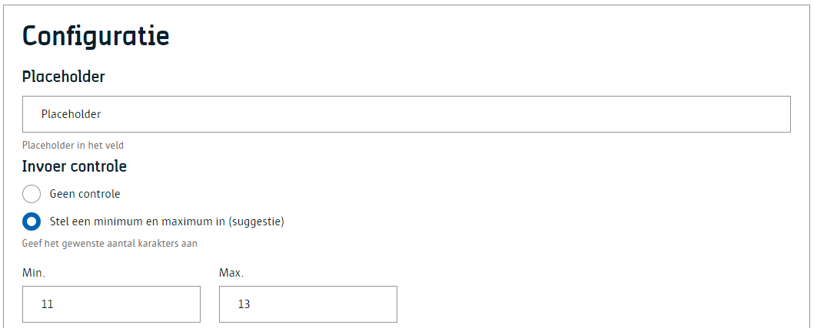
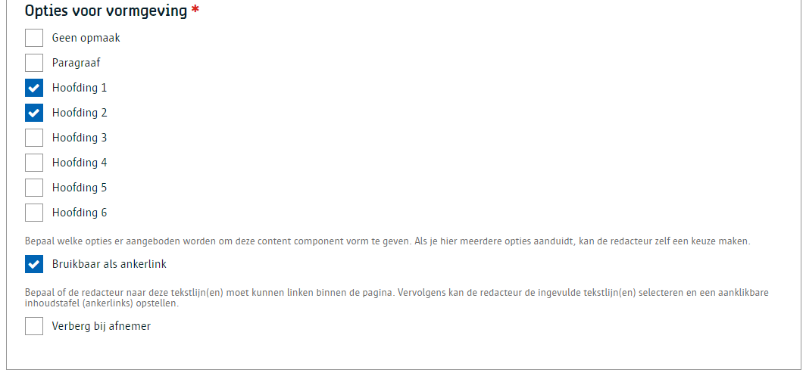
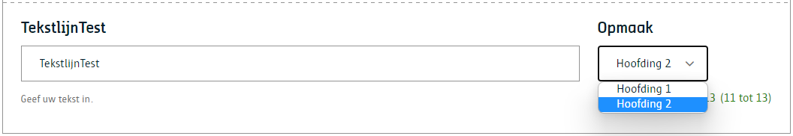
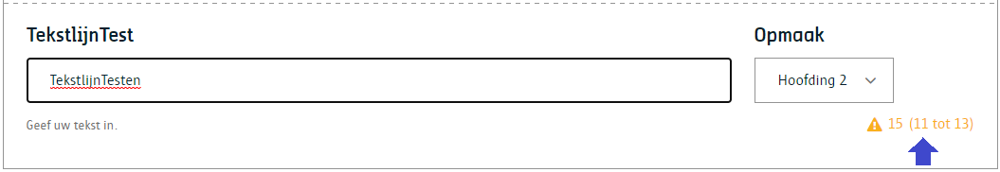

# Tekstlijn

Een component waarmee een redacteur **één tekstlijn** kan toevoegen, mogelijks ook te gebruiken als **ankerpunt**.

# Voor content beheerders

Een contentbeheerder kan : 
* een placeholder benaming ingeven.
* bepalen hoeveel karakters (min. en max.) voor ingeven van tekst zijn toegestaan.
* één of meerdere vormgevingen ter beschikken stellen waaruit de redacteur kan kiezen.
* bepalen of de redacteur naar deze tekslijn moet kunnen linken (ankerlink) binnnen de pagina.
* bepalen of de tekstlijn zichtbaar is voor de afnemer.






# Voor redacteurs
Een redacteur kan : 
* een tekstlijn ingeven (rekening houdende met min. en max karakters indien geconfigureerd).
* selecteren (indien geconfigureerd) in welke vormgeving deze tekst moet verschijnen.



**Merk op** : Bij het niet respecteren van de min. of max. aantal karakters zal de label met de validatieregels van kleur veranderen. Dit is echter niet restrictief.



# Voor ontwikkelaars

## Output zonder opmaak

```json
{
    "_id": "639b2607f07ca50007092544",
    "fields": {
        "tekstlijn-test": {
            "textType": "div",
            "text": "Tekstlijntesten"
        },
    "uuid": "2e038d59-aa5b-4744-8b36-dd3823347396",
    ...
}
```

## Output met opmaak

```json
{
    "_id": "639b2607f07ca50007092544",
    "fields": {
        "tekstlijn-test": {
            "textType": "h3",
            "text": "Tekstlijntesten"
        },
    "uuid": "2e038d59-aa5b-4744-8b36-dd3823347396",
    ...
}
```

# Voor bezoekers

NA

?> Ga terug naar het [overzicht van alle content componenten](/redactie/content/inrichten-cc-standaard.md)