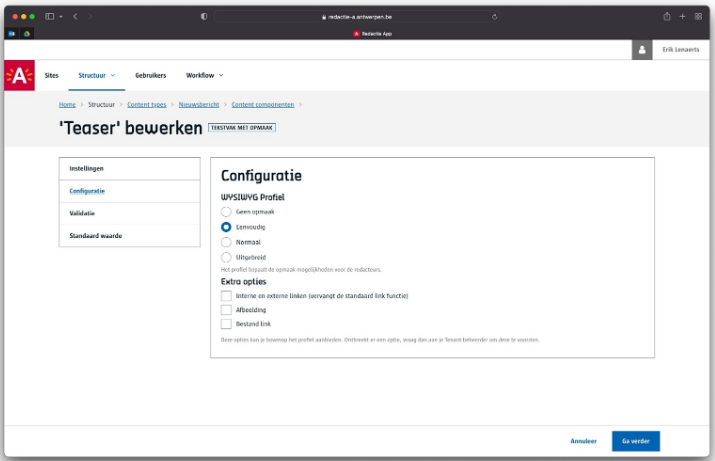
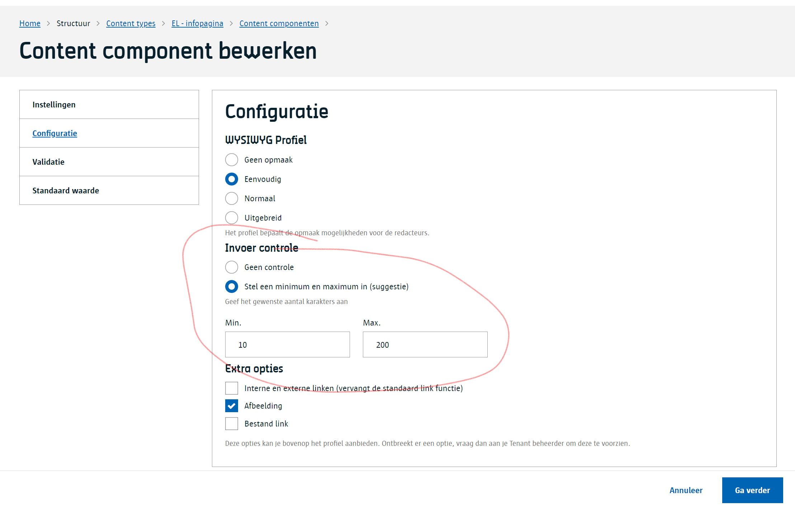
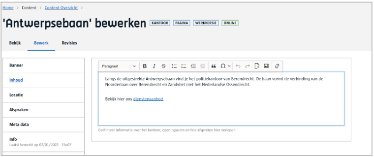
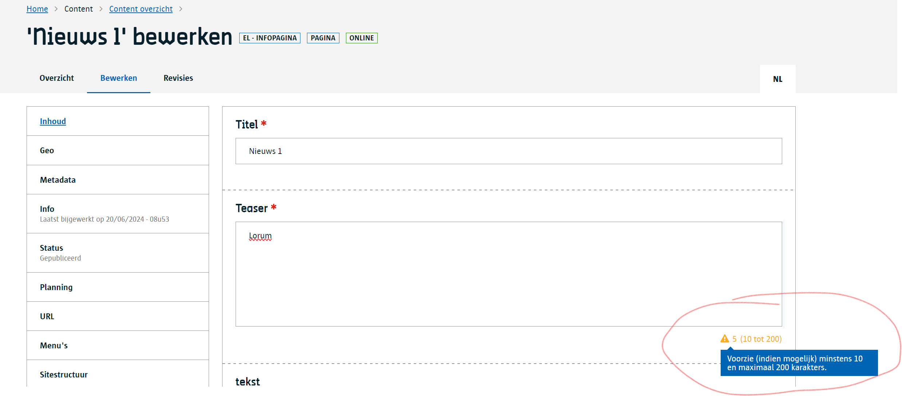
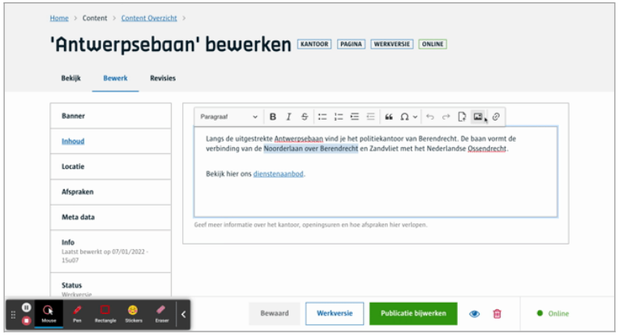

# Tekstvak met opmaak

Dit is een tekstvak waarin je één of meerdere paragrafen **tekst kan invoeren** en je kan **de vormgeving ervan aanpassen** (in beperkte mate), i.e.:

- de stijl, paragraaf of hoofding 1-6
- vet, cursief, onderlijnd of doorgehaald
- markering (bv in het geel) zet de achtergrondkleur van de geselecteerde tekst
- inspringen van een paragraaf
- nummer of bullet lijsten
- links, rechts, gecentreerd of volledig uitlijnen
- link toevoegen (*)
- een paragraaf als een quote opmaken
- een (programmatie) code block
- een tabel
- een horizontale lijn
- een speciaal symbool zoals bv ©

## Voor content beheerders

### Profielen

Als contentbeheerder kan je enkel een ‘profiel’ kiezen waarmee je in essentie de knoppen instelt van de toolbar boven het tekstvak met opmaak.



Hieronder is een overzicht van welke knoppen de redacteuren ter beschikking krijgen voor je gekozen profiel.

|                             | geen opmaak | eenvoudig | normaal | uitgebreid |
|-----------------------------|-------------|-----------|---------|------------|
| Paragraaf stijl             |             |     x     |    x    |      x     |
| Hoofding 1 stijl            |             |           |         |      x     |
| Hoofding 2 stijl            |             |           |         |      x     |
| Hoofding 3 stijl            |             |     x     |    x    |      x     |
| Hoofding 4 stijl            |             |     x     |    x    |      x     |
| Hoofding 5 stijl            |             |     x     |    x    |      x     |
| Hoofding 6 stijl            |             |     x     |    x    |      x     |
| vet                         |             |     x     |    x    |      x     |
| cursief                     |             |     x     |    x    |      x     |
| onderlijnd                  |             |           |         |      x     |
| doorgehaald                 |             |     x     |    x    |      x     |
| markering                   |             |           |         |      x     |
| inspringen (meer of minder) |             |     x     |    x    |      x     |
| nummer lijst                |             |     x     |    x    |      x     |
| bullet lijst                |             |     x     |    x    |      x     |
| Uitlijning                  |             |     x     |    x    |      x     |
| link toevoegen (*)          |             |           |    x    |      x     |
| Quote opmaak                |             |           |    x    |      x     |
| een code block              |             |           |         |      x     |
| een tabel                   |             |           |         |      x     |
| een horizontale lijn        |             |           |         |      x     |
| een speciaal symbool        |             |           |    x    |      x     |

(*) er is een [uitbreiding](/redactie/content/inrichten-cc-tekstvak-met-opmaak#Uitbreidingen) die het standaard gedrag van de link knop veranderd (zie hieronder)

> [!info|label:Tip]
> Merk op dat er ook een ‘geen opmaak’-profiel  bestaat. Deze is handig in geval je als contentbeheerder nog niet zeker bent dat je wel of niet opmaak wil toestaan.
> In essentie komt dit profiel overeen met het gedrag van een gewoon Tekstvak. Door toch te kiezen voor een Tekstvak met opmaak en het ‘geen opmaak’-profiel kan je nog alle
> richtingen uit.

### Invoer controle

Wil je uw redacteurs ondersteunen doordat ze teksten voorzien van een zekere lengte.
Gebruik dan de invoercontrole optie waar je kan instellen hoeveel karakters er minimaal en maximaal ingevoerd mogen worden.
Het systeem gaat deze controle niet afdwingen enkel duidelijk maken aan de redacteur.



### Uitbreidingen

Volgende uitbreidingen kunnen aangevraagd worden bij de Tenant Beheerder die extra WCM [modules](https://docs.google.com/spreadsheets/d/1OIwIALMTWy9D8o6iJOCiN6axOqGOdtirJ0Khe3-6BFQ/edit#gid=0) zal activeren voor jouw tenant.

#### Afbeeldingen of bestanden invoegen

**Module**: Ckeditor assets upload plugin

Via deze module komen er 2 opties bij voor de redacteurs:

- invoegen van afbeeldingen
  - enkel uploads, deze komen wel in de beeldenbank terecht
- invoegen van bijlagen
  - enkel uploads, deze komen wel in de beeldenbank terecht

#### Ondersteuning voor interne linken

**Module**: CKEditor plugin link module

Deze module vervangt de standaard link knop zodat een redacteur naast een externe link (andere websites) ook een link kan leggen naar een ander content item vanuit een Tekstvak met opmaak.

## Voor redacteurs

Redacteurs krijgen een tekstvak met meerdere lijnen te zien.
Van zodra ze hun cursor hier in plaatsen verschijnt er bovenaan het tekstvak een knoppenbalk (toolbar) met de beschikbare opties obv het gekozen profiel van de contentbeheerder.



Als er een invoer controle is ingesteld dan zal je als redacteur geholpen worden door een karakter teller rechtsonderaan. Van zodra deze groen kleurt zit je goed.
Kleurt deze oranje voldoe je niet aan het minimum of maximum aantal karakters.
Het systeem zal je wel niet beletten om dit te bewaren. Het is een hulpmiddel in plaats van een harde regel.




### Afbeelding of bijlages

!> to do

### Interne linken



([Bekijk dit op YouTube](https://youtu.be/UoJ9B8n7ylo':target="_blank"'))

## Voor ontwikkelaars

### Tekstvak

Een Tekstvak met opmaak zal resulteren in HTML.

```json
{
   "_id": "60e6b1aeab7b36000947a534",
   "fields": {
       "beschikbare-plaatsen": 5
   },
   "omschrijving": "<p>Langs de uitgestrekte <b>Antwerpsebaan</b> vind je het politiekantoor van Berendrecht. De baan vormt de verbinding van de Noorderlaan over Berendrecht en Zandvliet met het Nederlandse Ossendrecht.</p>...",
   ...
}
```

### Interne linken

Wanneer een interne link wordt gelegd (als [deze uitbreiding](/redactie/content/inrichten-cc-tekstvak-met-opmaak#Ondersteuning-voor-interne-linken) geactiveerd is)

```json
{
   "_id": "60e6b1aeab7b36000947a534",
   "fields": {
       "beschikbare-plaatsen": 5
   },
   "omschrijving": "<p><a href=\"https://www.antwerpen.test.be/mobiliteit-en-parkeren\" data-redactie-internal-link=\"true\" data-content-uuid=\"26592882-44da-4105-9616-3a56fee17ee5\" data-siteurl=\"https://www.antwerpen.test.be\">sdqsdqsdqsd</a></p>",
   ...
}
```

Je krijgt volgende data terug:

- href = volledig absoluut pad
- data-redactie-internal-link=true -> geeft aan dat het een interne link is
- data-content-uuid: de uuid van het content item waarnaar verwezen wordt
- data-siteurl: de url die is ingesteld op site niveau

## Voor bezoekers

NA

?> Ga terug naar het [overzicht van alle content componenten](/redactie/content/inrichten-cc-standaard.md)