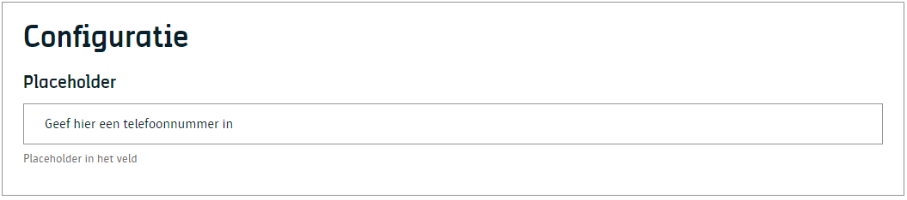
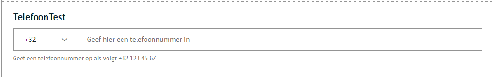

# Telefoonnummer

Een component waarmee een redacteur een telefoonnummer kan ingeven.

# Voor content beheerders

Een contentbeheerder kan een placeholder benaming meegeven. 



# Voor redacteurs

Een redacteur kan het telefoonnummer ingeven.



# Voor ontwikkelaars

## Output zonder ingave telefoonnummer

```json
{
    "_id": "639b2607f07ca50007092544",
    "fields": {
       "test-tel-nummer": {
            "areaCode": "+32",
            "number": ""
        },
    "uuid": "2e038d59-aa5b-4744-8b36-dd3823347396",
    ...
}
```

## Output met ingave telefoonnummer

```json
{
    "_id": "639b2607f07ca50007092544",
    "fields": {
       "test-tel-nummer": {
            "areaCode": "+32",
            "number": "474 00 00 00"
        },
    "uuid": "2e038d59-aa5b-4744-8b36-dd3823347396",
    ...
}
```

# Voor bezoekers

NA

?> Ga terug naar het [overzicht van alle content componenten](/redactie/content/inrichten-cc-standaard.md)