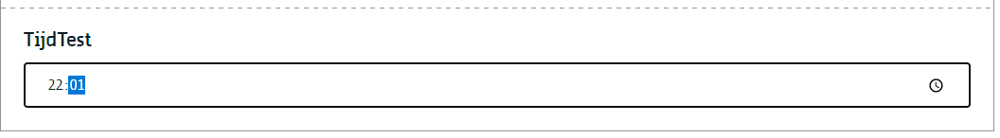
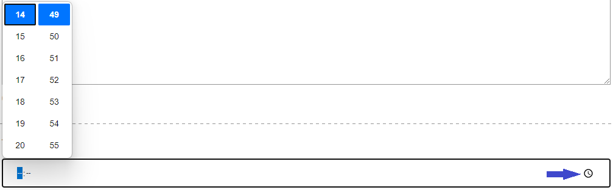

# Tijd
Een component waarmee een redacteur een tijd kan instellen.

# Voor content beheerders

Er zijn geen configuratie opties voor de contentbeheerder.

# Voor redacteurs
Een redacteur kan een tijd invoeren via het keyboard of één te kiezen via de tijdslijn door op het uurwerk icoon te klikken achter het invoerveld

# Voor ontwikkelaars

!> To Do

# Voor bezoekers

!> To Do

?> Ga terug naar het [overzicht van alle content componenten](/redactie/content/inrichten-cc-standaard.md)

