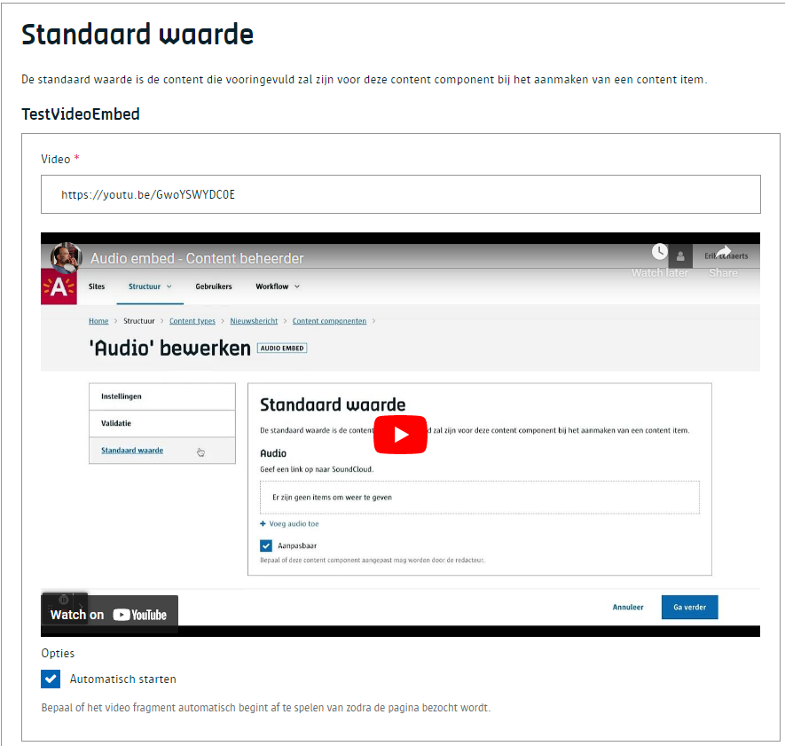

# Video embed
Geef een url van een videofragment. Dit werkt heel gelijkaardig zoals een [audio embed](/redactie/content/inrichten-cc-audio-embed.md) component.

# Voor contentbeheerders
De enige configuratie optie is om aan te geven aan de frontend dat een videofragment automatisch mag afgespeeld worden.

# Voor redacteurs
Een redacteur kan eenvoudigweg een videolink plakken in het voorziene vak en er komt een preview zodat de redacteur kan zien / horen of de juiste link geplakt is.

# Voor ontwikkelaars

!> To Do

?> Ga terug naar het [overzicht van alle content componenten](/redactie/content/inrichten-cc-standaard.md)

