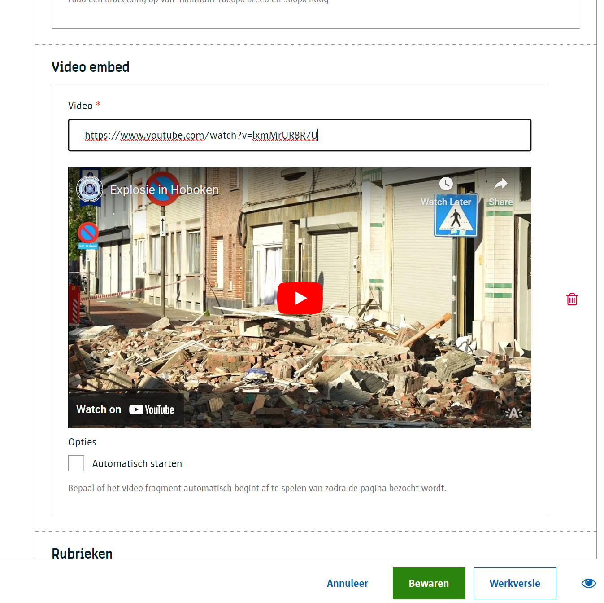

# Video embed

Geef een url van een videofragment. Dit werkt heel gelijkaardig zoals een [audio embed](/redactie/content/inrichten-cc-audio-embed.md) component.

## Voor contentbeheerders

Er zijn geen specifieke instellingen voorzien voor de video embed.

## Voor redacteurs

Een redacteur kan eenvoudigweg een videolink plakken in het voorziene vak en er komt een preview zodat de redacteur kan zien en horen of de juiste link geplakt is.



> [!info]
> Je kan als redacteur met verschillende soorten YouTube url's werken; waaronder:
>
> * <https://www.youtube.com/watch?v=bH7AfOm4_vc>
> * <https://www.youtube.com/embed/bH7AfOm4_vc>
> * <https://youtu.be/bH7AfOm4_vc>
>
> Al deze varianten worden ondersteund. Het systeem zal ze automatisch omzetten naar de juiste Url zodat deze getoond kunnen worden in een YouTube video player op website.

## Voor ontwikkelaars

### Output met autostart van videofragment

```json
{
    "_id": "639b2607f07ca50007092544",
    "fields": {
        "test-video-embed": {
            "opties": [
                "autoplay"
            ],
            "video": "https://www.youtube.com/embed/GwoYSWYDC0E"
        },
    "uuid": "2e038d59-aa5b-4744-8b36-dd3823347396",
    ...
}
```

?> Ga terug naar het [overzicht van alle content componenten](/redactie/content/inrichten-cc-standaard.md)