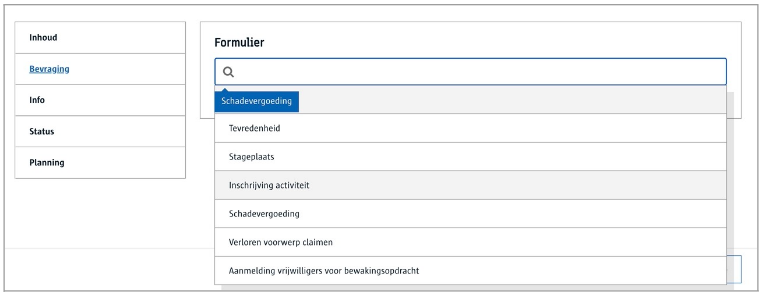
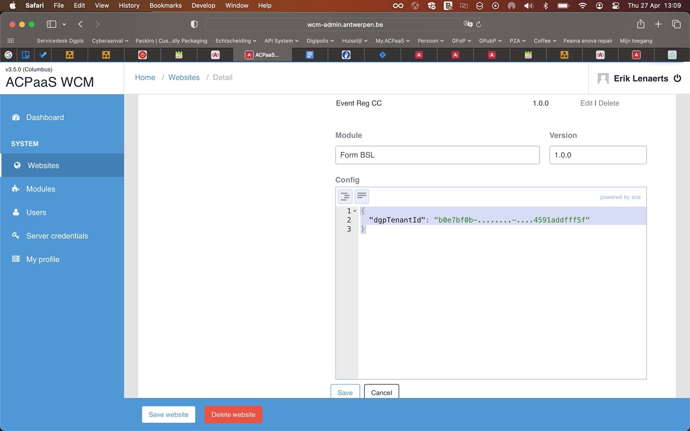

# Formulieren inrichten

Met deze module kan je aan een redacteur een lijst aanbieden van beschikbare formulieren waaruit hij/zij kan kiezen. 



> Zorg ervoor dat de [Forms module](/modules/content/modules/module-forms) geactiveerd is voor je tenant. 

Deze lijst met formulieren komt uit de [forms engine](https://acpaas.digipolis.be/nl/product/form-survey-engine) waarbij een ontwerper deze eerst gemaakt heeft in de [form composer](http://formcomposer.antwerpen.be). Net zoals de WCM hier is ook de form engine **multitenant** opgezet. Dat betekent dat formulieren worden ontworpen en bewaard in een specifieke tenant. 

Om het geheel te laten werken zijn er enkele zaken nodig:

* zorg dat je een tenant hebt in de forms engine en [dat de WCMv4 er aan kan](redactie/content/inrichten-forms?id=voorbereiding-forms-engine)
* zorg dat er formulieren in gemaakt zijn (published)
* Configureer de forms

## Voorbereiding Forms engine
De WCMv4 moet toegang krijgen tot jouw tenant op de Forms Engine. De WCM is gekend als de **Redactie WCM Forms** app. Dit doe je door een ticket aan servicedesk@digipolis.be te richten met:

> [!info|label:Aanvraag]
>
> Beste
>
> kan de App **Redactie WCM Forms** voorzien worden op de tenant **&lt;tenant naam&gt;** (uuid=&lt;tenant uuid&gt;) op **ACC|Prod** ?
>
> dankjewel

Hier zal je wellicht enkele dagen op moeten wachten tot dit in orde is.

## Voorbereiding redactie

Vooraleer een redacteur de form referentie kan gebruiken moet een [Tenant beheerder](/redactie/content/toegang-tenant-beheerder) eerst duidelijk maken met welke forms engine tenant er gewerkt moet worden. Dit wordt in de WCM Admin ingesteld door de Forms BSL. 



Gebruik voor de configuratie volgende json:

```json
{
  "dgpTenantId": "f5b61753-2222-4c10-b704-8540f80a192b"
}
```
