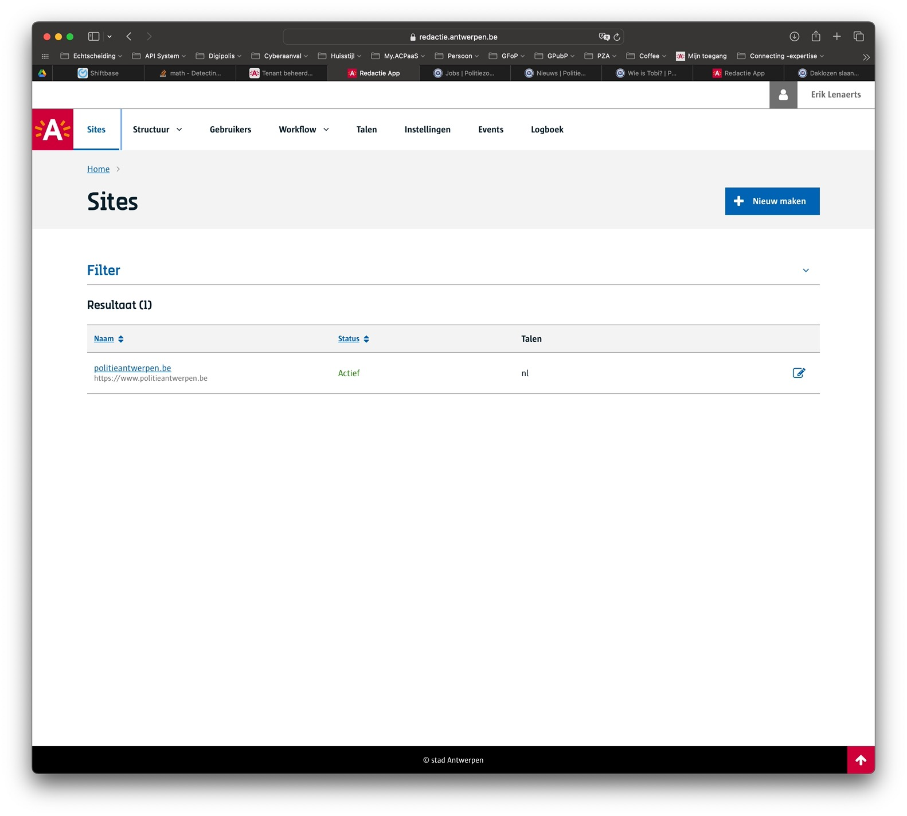
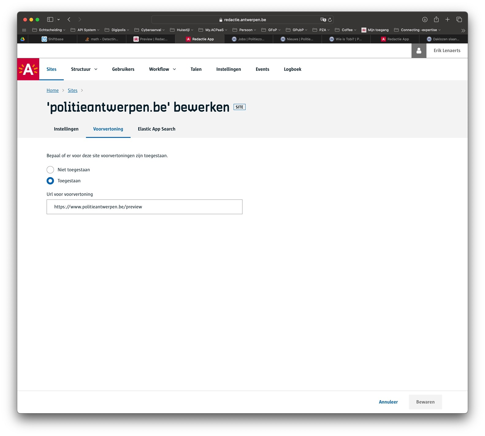
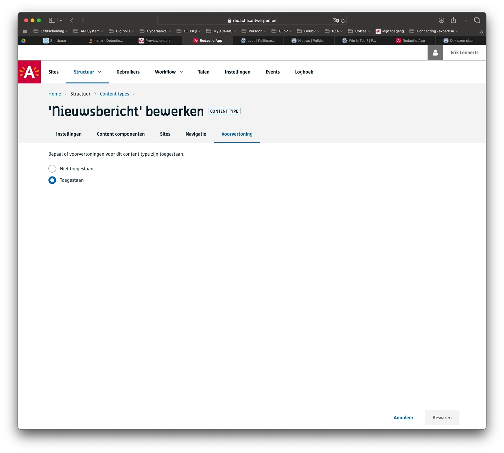

# Preview inrichten

> [!info|label:Definitie]
> `Preview` of voorvertoning geeft redacteurs de mogelijkheid om content te bekijken hoe deze er zou uitzien vooraleer ze deze moeten publiceren.

Vooraleer redacteurs ermee aan de slag kunnen zal je eerst aan je tenant beheerder moeten vragen om de [preview module](/modules/content/modules/module-preview) te activeren voor je tenant.

## Site instellingen

Als [tenant beheerder](/redactie/content/toegang-tenant-beheerder) zal je de site instellingen moeten aanpassen. De voorvertoning functie staat standaard uit.
Ga hiervoor naar het overzicht van sites.

Klik op de bewerk actie en kies vervolgens voor `voorvertoning` sectie.
Sta de voorvertoning toe en geef de basis url op die gebruikt wordt voor de preview. Dit kan dezelfde basis url zijn dan die van de site zelf of een andere zoals in onderstaand voorbeeld.
Frontend ontwikkelaars gebruiken deze basis url soms om te ontdekken dat er een preview aangevraagd is.

## Content type instellingen

Als content beheerder kan je aangeven voor welk content type je de voorvertoning wil activeren.
Dikwijls is dit in samenspraak met frontend developers die op hun beurt [preview ondersteuning inbouwen](/frontend/content/frontend-previews) per content type.

Open het content type en navigeer naar de `voorvertoning` sectie. Activeer de voorvertoning

?> Met bovenstaande instelling kunnen redacteurs aan de slag met de preview. [Lees er hier meer over](/redactie/content/content-beheren-preview).

