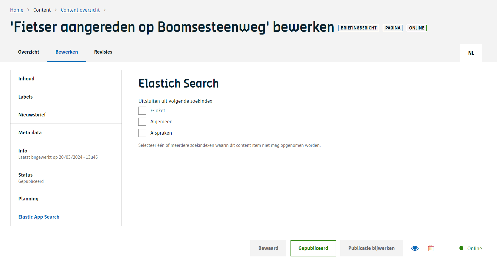

# Content indexeren

Content wordt in een Elastic App Search engine geïndexeerd als het content type opgenomen is in de index.

?> Lees hier over het verschil tussen [een engine en een index](/redactie/content/inrichten-search-indexvsengine).

Wil je een specifiek content item niet laten indexeren, dan kan je dit aangeven op het content item zelf.
Ga hiervoor naar een content item en bewerk dit. Daar zal je een extra compartiment Elastic App Search zien waar je dit kan aangeven.

> 
