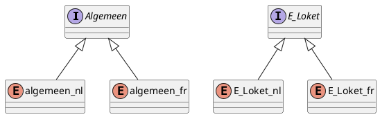
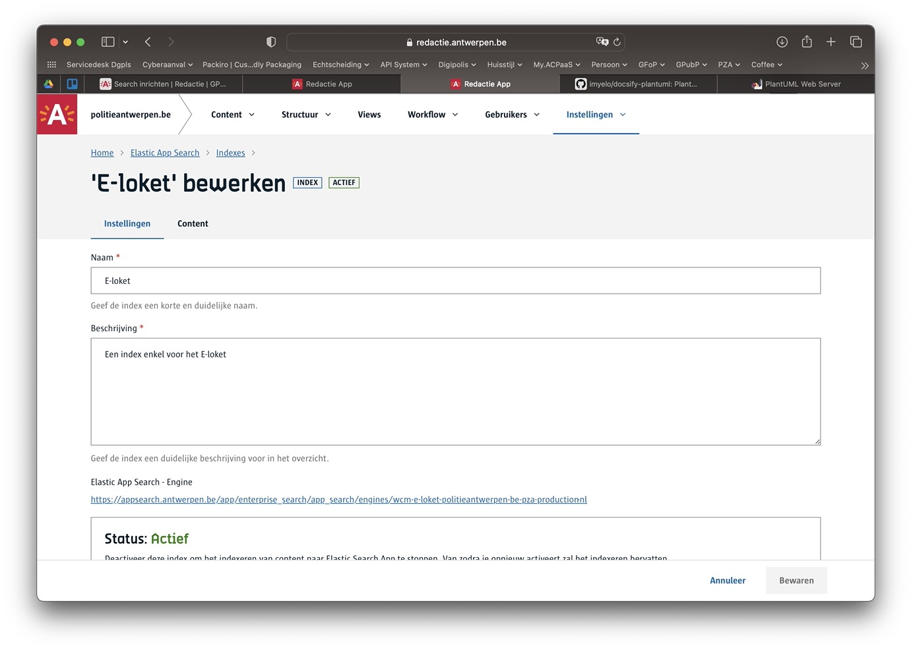

# Index vs engine?

In de redactie kennen we het concept `index`. Hierin verzamelen we content op een specifieke manier zodat er nadien in gezocht kan worden. 
In Elastic App Search spreken we van `engines`. Dit is de fysieke databank die aangemaakt wordt op het moment dat we in de Redactie een index aanmaken. 

Je kan één of meerdere indexen aanmaken in de redactie. Voor elke index wordt er automatisch een overeenkomstige engine gemaakt in Elastic App Search. Als de site [meertalig](/redactie/content/inrichten-meertaligheid) is ingericht zal elke **index hier overeenkomen met één engine per taal**.

In dit voorbeeld zie je een tweetalige site met 2 indexen en dus 2 keer 2 engines


### Waar vind je de indexen?

1. Ga naar de Redactie
2. Ga naar een tenant
3. Open de inhoud van een site
4. in het hoofdmenu vind je onder `Instellingen > Elastic App Search`


### Waar vind je de engines?

De engines worden zoals hierboven beschreven, automatisch aangemaakt per index. Deze volgen de volgende naamgevingstructuur: 

```
Naam van de engine = 

wcm-<naam-index>-<naam--site>-<naam--tenant>-production-<taal>
```
**Voorbeeld:** wcm-e-loket-politieantwerpen-be-pza-production-nl

Elastic App Search vind je hier: https://appsearch.antwerpen.be/app/enterprise_search/app_search/engines/

> [!info|label:Directe link naar de engine]
> Vanuit de Redactie kan je de details opvragen van een index. Hier staan onderaan ook de linken naar de Elastic App Search engines vermeld.
> 
